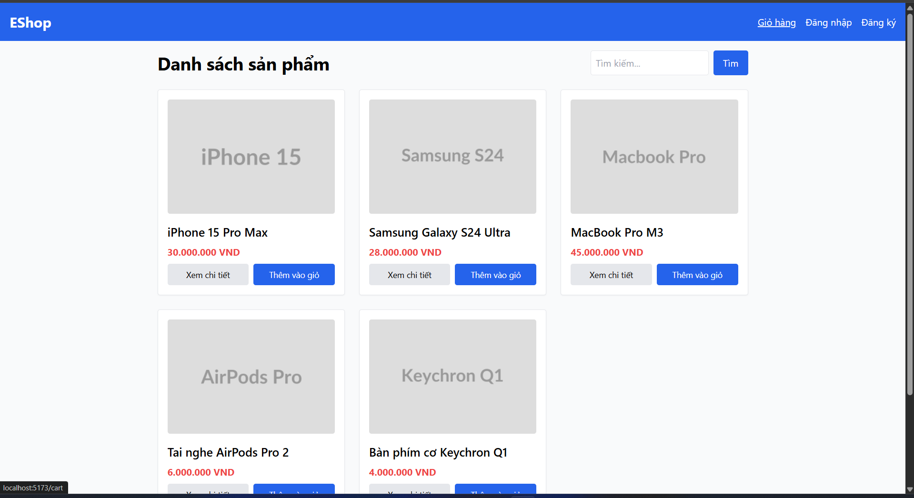

## Found by Test Case

HOME-GUI-IA01-049

## Requirement liên quan

N/A

## Severity / Priority

Minor / P3

## Environment

Browser: Google Chrome / Microsoft Edge, OS: Windows, URL: `http://localhost:5173`

## Steps to reproduce

1. Mở trang Home.
2. Hover hoặc truy cập qua lại các link điều hướng.
3. Quan sát trạng thái hiển thị của link và button.

## Expected result

Các link và nút phải có trạng thái hover/visited/active dễ phân biệt.

## Actual result

Trạng thái hover/visited/active chưa đủ rõ để phân biệt một cách nhất quán.

## Console / Repro

```text
const cart = document.querySelector('a[href="/cart"]');
getComputedStyle(cart).textDecorationLine;
```

## Evidence

- 
