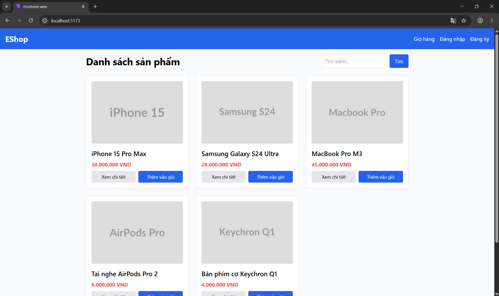
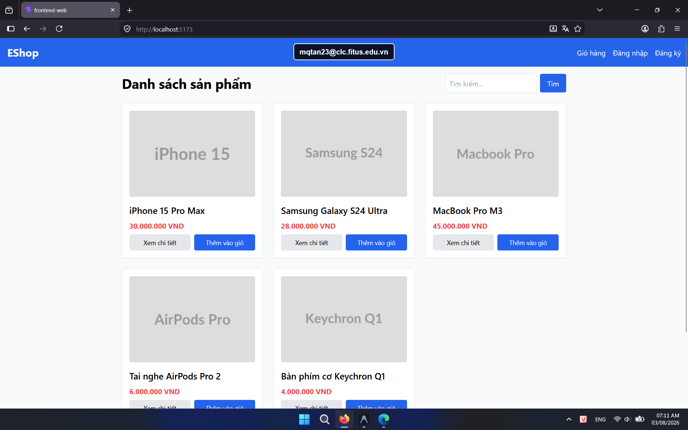

## Found by Test Case

HOME-GUI-IA01-052

## Requirement liên quan

N/A

## Severity / Priority

Minor / P3

## Environment

Browser: Google Chrome / Microsoft Edge, OS: Windows, URL: `http://localhost:5173`

## Steps to reproduce

1. Mở trang Home.
2. Nhìn vào tab của trình duyệt.
3. Kiểm tra title đang hiển thị.

## Expected result

Title phải mô tả đúng Home và không giữ tên scaffold mặc định.

## Actual result

Title vẫn là `frontend-web`, chưa đủ rõ cho người dùng nhận diện trang.

## Console / Repro

```javascript
document.title
```

## Evidence

- **Ảnh chụp lỗi trên Google Chrome:** 
- **Ảnh chụp lỗi trên Firefox:** 
