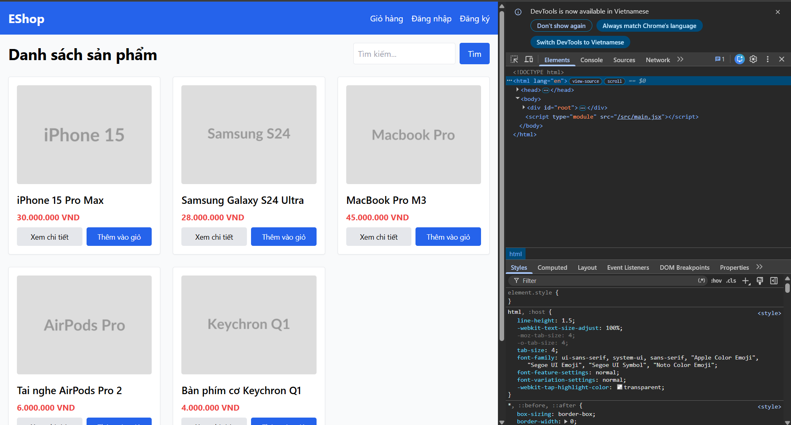
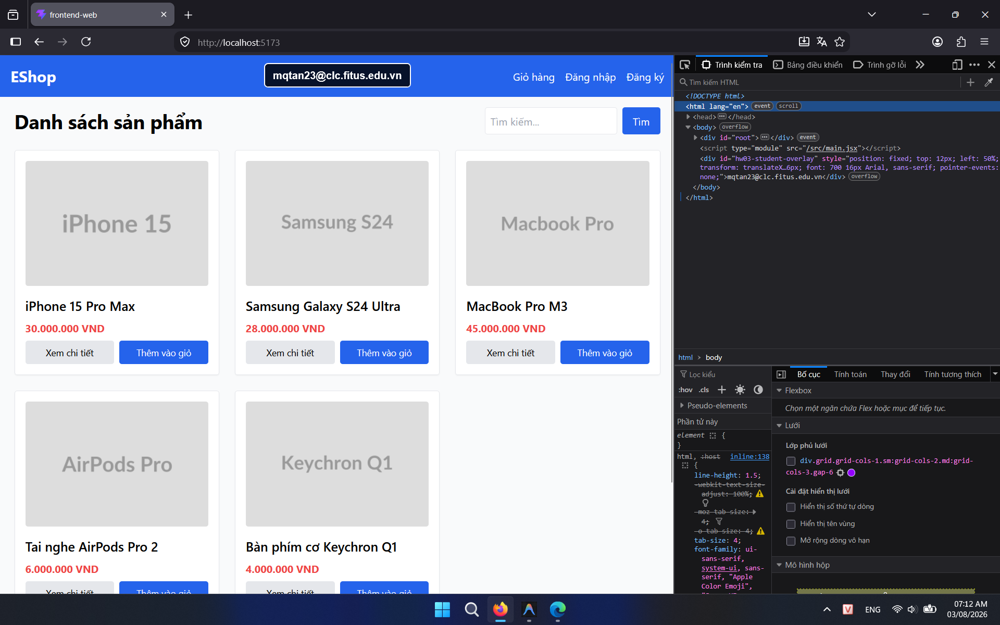

## Found by Test Case

HOME-GUI-IA01-054

## Requirement liên quan

N/A

## Severity / Priority

Minor / P3

## Environment

- Browser: Google Chrome (Windows 11)
- Browser: Mozilla Firefox (Windows 11)

URL: `http://localhost:5173` (hoặc local Metro Bundler với di động)

## Steps to reproduce

1. Mở trang Home.
2. Kiểm tra thuộc tính `lang` của thẻ `html`.
3. Đối chiếu với ngôn ngữ hiển thị của giao diện.

## Expected result

Thuộc tính `lang` phải phản ánh đúng ngôn ngữ tiếng Việt của trang.

## Actual result

Thuộc tính `lang` vẫn là `en`, chưa khớp với giao diện tiếng Việt.

## Console / Repro

```javascript
document.documentElement.lang
```

## Evidence

- **Ảnh chụp lỗi trên Google Chrome:** 
- **Ảnh chụp lỗi trên Firefox:** 
