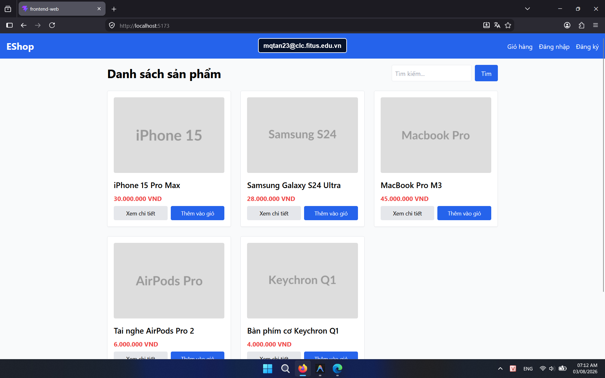

## Found by Test Case

HOME-GUI-IA02-013

## Requirement liên quan

FR-05, FR-21

## Severity / Priority

Minor / P3

## Environment

- Browser: Google Chrome (Windows 11)
- Browser: Mozilla Firefox (Windows 11)
- Device: Samsung Galaxy S9+ (Android 10) / App: Expo Go (React Native)

URL: `http://localhost:5173` (hoặc local Metro Bundler với di động)

## Steps to reproduce

1. Mở trang Home.
2. Quan sát ô tìm kiếm ở đầu trang.
3. Đọc placeholder hiện tại.

## Expected result

Placeholder phải mô tả rõ hành động, ví dụ `Tìm kiếm sản phẩm...`.

## Actual result

Placeholder chỉ là `Tìm kiếm...`, chưa nói rõ người dùng đang tìm gì.

## Console / Repro

```javascript
document.querySelector('input[type="text"]')?.placeholder
```

## Evidence

- **Ảnh chụp lỗi trên Google Chrome:** 
- **Ảnh chụp lỗi trên Firefox:** 
- **Ảnh chụp lỗi trên Expo Go (Android):** 
