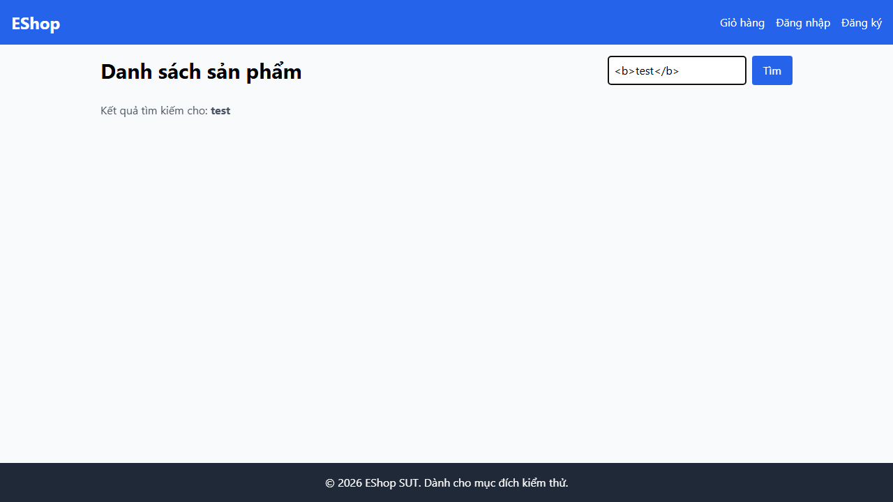

## Found by Test Case

HOME-GUI-IA02-016

## Requirement liên quan

SEC-04, FR-05

## Severity / Priority

Major / P1

## Environment

Browser: Google Chrome / Microsoft Edge, OS: Windows, URL: `http://localhost:5173`

## Steps to reproduce

1. Mở trang Home.
2. Nhập một chuỗi có chứa HTML như `<b>test</b>` vào ô tìm kiếm.
3. Kích hoạt tìm kiếm.

## Expected result

Từ khóa phải được hiển thị an toàn dưới dạng text thuần, không render HTML.

## Actual result

Trang render nội dung HTML từ chuỗi tìm kiếm, nên markup không được xử lý an
toàn như text thuần.

## Console / Repro

```text
const input = document.querySelector('input[type="text"]');
input.value = '<b>test</b>';
input.dispatchEvent(new Event('input', { bubbles: true }));
input.closest('form').requestSubmit();
```

## Evidence

- 
