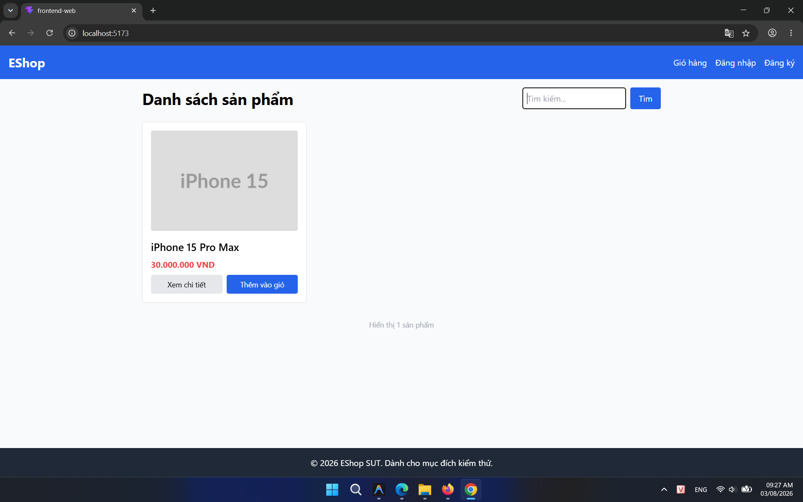
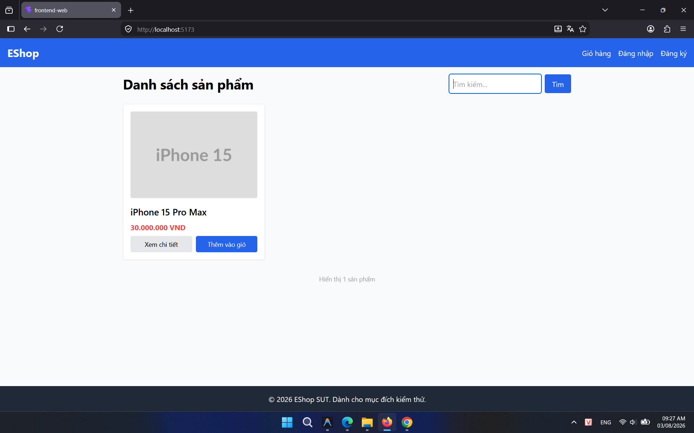

## Found by Test Case

HOME-GUI-IA02-018

## Requirement liên quan

FR-05

## Severity / Priority

Minor / P3

## Environment

- Browser: Google Chrome (Windows 11)
- Browser: Mozilla Firefox (Windows 11)
- Device: Samsung Galaxy S9+ (Android 10) / App: Expo Go (React Native)

URL: `http://localhost:5173` (hoặc local Metro Bundler với di động)

## Steps to reproduce

1. Mở trang Home (`http://localhost:5173`).
2. Nhập từ khóa vào ô tìm kiếm, ví dụ: `iphone`.
3. Nhấn nút **Tìm** — danh sách lọc xuống theo từ khóa.
4. Xóa toàn bộ nội dung ô tìm kiếm (bôi đen + Delete hoặc Backspace).
5. Quan sát danh sách sản phẩm mà không nhấn "Tìm" thêm lần nào.

## Expected result

Sau khi xóa hết nội dung ô tìm kiếm, danh sách sản phẩm phải tự động hiển thị lại toàn bộ sản phẩm (reset về trạng thái ban đầu).

## Actual result

Danh sách sản phẩm không thay đổi — vẫn hiển thị kết quả lọc theo từ khóa cũ. Người dùng phải nhấn nút **Tìm** thêm một lần nữa với ô trống mới lấy lại toàn bộ danh sách.

## Console / Repro

```javascript
// Kiểm tra giá trị ô tìm kiếm sau khi xóa
document.querySelector('input[type="text"]')?.value;
// Kết quả: "" (rỗng) — nhưng danh sách vẫn giữ kết quả cũ
```

## Evidence

- **Ảnh chụp lỗi trên Google Chrome:** 
- **Ảnh chụp lỗi trên Firefox:** 
- **Ảnh chụp lỗi trên Expo Go (Android):** 
