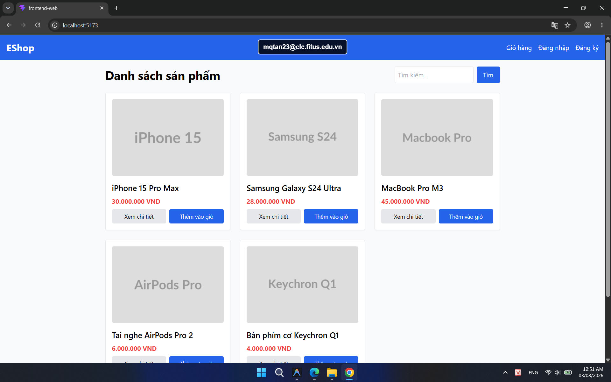
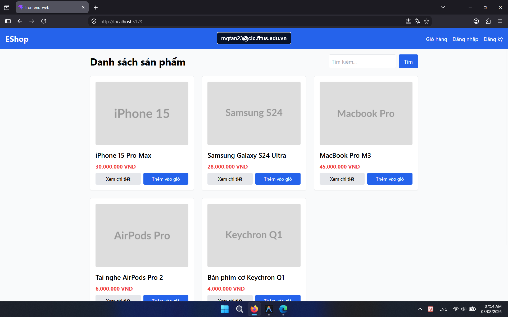

## Found by Test Case

HOME-GUI-IA03-021

## Requirement liên quan

FR-23

## Severity / Priority

Minor / P3

## Environment

- Browser: Google Chrome (Windows 11)
- Browser: Mozilla Firefox (Windows 11)
- Device: Samsung Galaxy S9+ (Android 10) / App: Expo Go (React Native)

URL: `http://localhost:5173` (hoặc local Metro Bundler với di động)

## Steps to reproduce

1. Mở trang Home.
2. Quan sát mục Trang Chủ trong navbar.
3. Kiểm tra trạng thái active hiện tại.

## Expected result

Navbar phải thể hiện rõ mục Trang Chủ đang active khi user ở Home.

## Actual result

Navbar không có active state rõ ràng cho mục Trang Chủ.

## Console / Repro

```javascript
document.querySelector('a[aria-current="page"]')?.textContent
```

## Evidence

- **Ảnh chụp lỗi trên Google Chrome:** 
- **Ảnh chụp lỗi trên Firefox:** 
- **Ảnh chụp lỗi trên Expo Go (Android):** 

## GitHub Issue

https://github.com/yuran1811/hcmus-sw-testing--eshop-sut/issues/180
