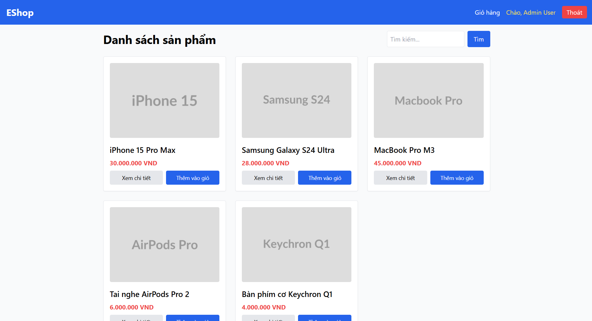

## Found by Test Case

HOME-GUI-IA03-023

## Requirement liên quan

FR-23

## Severity / Priority

Minor / P2

## Environment

Browser: Google Chrome / Microsoft Edge, OS: Windows, URL: `http://localhost:5173`

## Steps to reproduce

1. Đăng nhập bằng tài khoản hợp lệ.
2. Mở lại trang Home.
3. Quan sát nút thoát trên header.

## Expected result

Nút phải hiển thị đúng nhãn `Đăng xuất`.

## Actual result

Nút đang hiển thị là `Thoát`, không khớp nhãn yêu cầu.

## Console / Repro

```text
localStorage.getItem('token');
document.querySelector('button.bg-red-500')?.textContent;
```

## Evidence

- 
