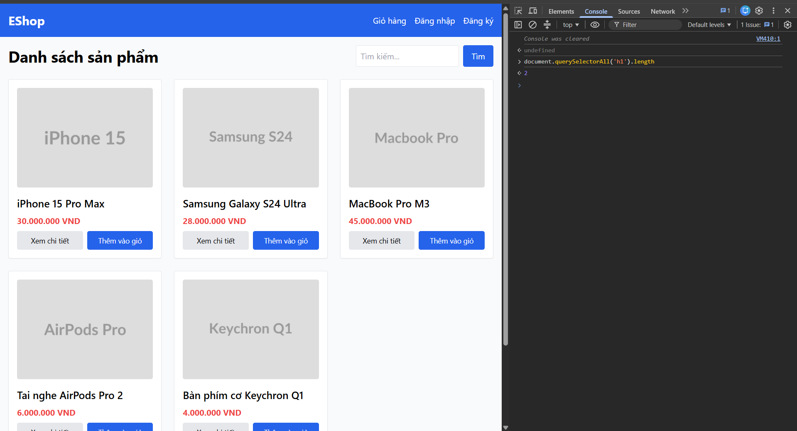
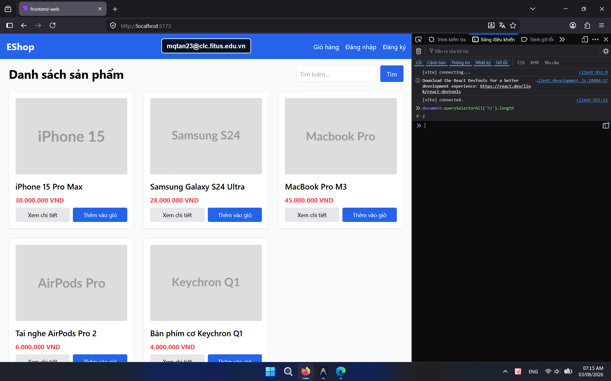

## Found by Test Case

HOME-GUI-IA03-024

## Requirement liên quan

FR-05, FR-21

## Severity / Priority

Minor / P3

## Environment

Browser: Google Chrome / Microsoft Edge, OS: Windows, URL: `http://localhost:5173`

## Steps to reproduce

1. Mở trang Home.
2. Kiểm tra số lượng thẻ `h1` trong DOM.
3. Đối chiếu với quy tắc chỉ có một `h1`.

## Expected result

Home chỉ nên có đúng một thẻ `h1`.

## Actual result

Trang Home đang có nhiều hơn một thẻ `h1`.

## Console / Repro

```javascript
document.querySelectorAll('h1').length
```

## Evidence

- **Ảnh chụp lỗi trên Google Chrome:** 
- **Ảnh chụp lỗi trên Firefox:** 
