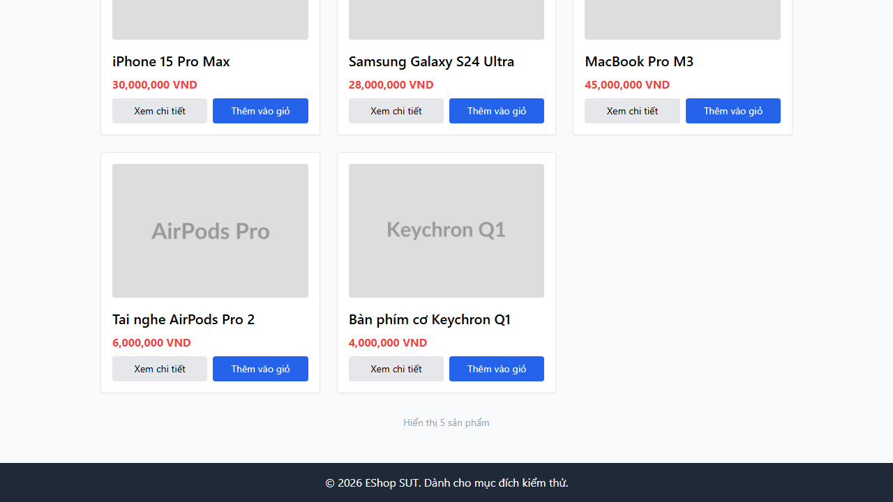
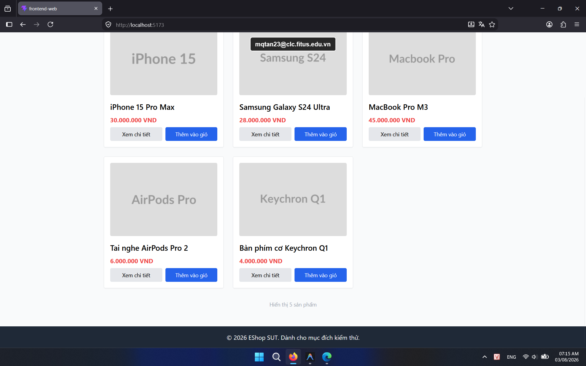

## Found by Test Case

HOME-GUI-IA03-029

## Requirement liên quan

N/A

## Severity / Priority

Minor / P3

## Environment

- Browser: Google Chrome (Windows 11)
- Browser: Mozilla Firefox (Windows 11)
- Device: Samsung Galaxy S9+ (Android 10) / App: Expo Go (React Native)

URL: `http://localhost:5173` (hoặc local Metro Bundler với di động)

## Steps to reproduce

1. Mở trang Home.
2. Kéo xuống footer.
3. Kiểm tra các link điều hướng ở footer.

## Expected result

Footer phải có các link hoạt động, không làm người dùng bị dead-end.

## Actual result

Footer không có link điều hướng nào.

## Console / Repro

```javascript
[...document.querySelectorAll('footer a')].map((a) => ({ text: a.textContent.trim(), href: a.href }))
```

## Evidence

- **Ảnh chụp lỗi trên Google Chrome:** 
- **Ảnh chụp lỗi trên Firefox:** 
- **Ảnh chụp lỗi trên Expo Go (Android):** 
