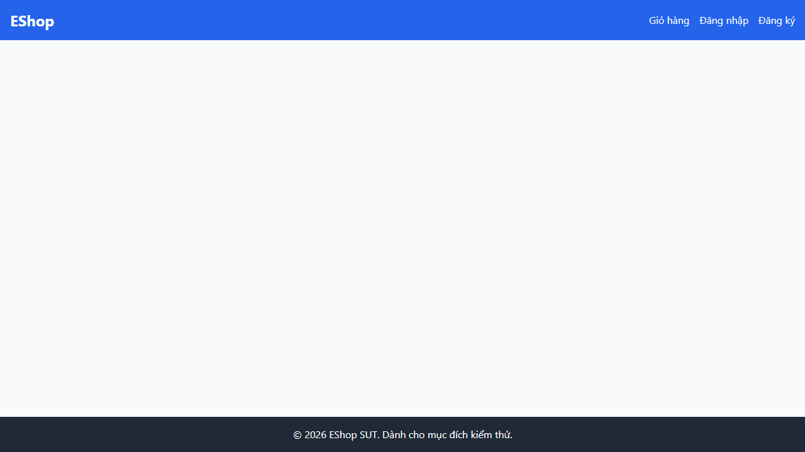

## Found by Test Case

HOME-GUI-IA03-048

## Requirement liên quan

N/A

## Severity / Priority

Major / P2

## Environment

Browser: Google Chrome / Microsoft Edge, OS: Windows, URL: `http://localhost:5173`

## Steps to reproduce

1. Mở một URL không tồn tại trong web app.
2. Quan sát phản hồi của hệ thống.
3. Kiểm tra có trang 404 thân thiện hay không.

## Expected result

Hệ thống phải hiển thị trang 404 thân thiện và có đường quay về Home.

## Actual result

Đường dẫn không tồn tại không được xử lý bằng một trang 404 thân thiện.

## Console / Repro

```text
location.href = '/does-not-exist';
```

## Evidence

- 
