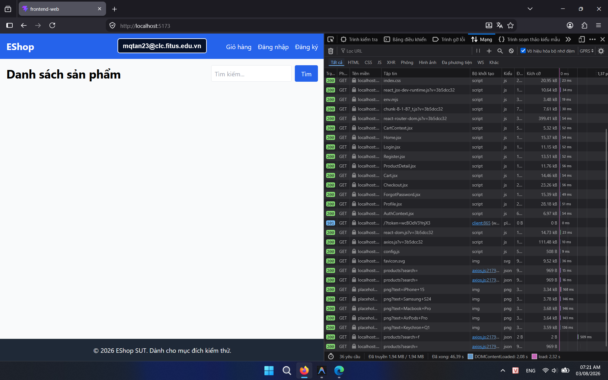

## Found by Test Case

HOME-GUI-IA04-031

## Also observed by Usability Finding

[F10 — Sessions P03, P04, P06](../../../../usability-tests/U-001/4_reports-synthesis/usability_evaluation_report.md#5-findings)

## Requirement liên quan

FR-05, Nielsen #1 Visibility

## Severity / Priority

Major / P2

## Environment

- Browser: Google Chrome (Windows 11)
- Browser: Mozilla Firefox (Windows 11)

URL: `http://localhost:5173` (hoặc local Metro Bundler với di động)

## Steps to reproduce

1. Mở trang Home.
2. Quan sát lúc danh sách sản phẩm đang được tải.
3. Tìm loading indicator trên màn hình.

## Expected result

Trang phải hiển thị loading state như spinner hoặc skeleton card.

## Actual result

Không có loading state rõ ràng khi danh sách sản phẩm đang tải.

## Console / Repro

```javascript
Open DevTools > Network, set throttling to `Slow 3G`, then reload Home.
```

## Evidence

- **Ảnh chụp lỗi trên Google Chrome:** 
- **Ảnh chụp lỗi trên Firefox:** 
- [U-001 bug index & evidence — F10](../../../../usability-tests/U-001/5_evidence/bug_index.md#finding-evidence)
