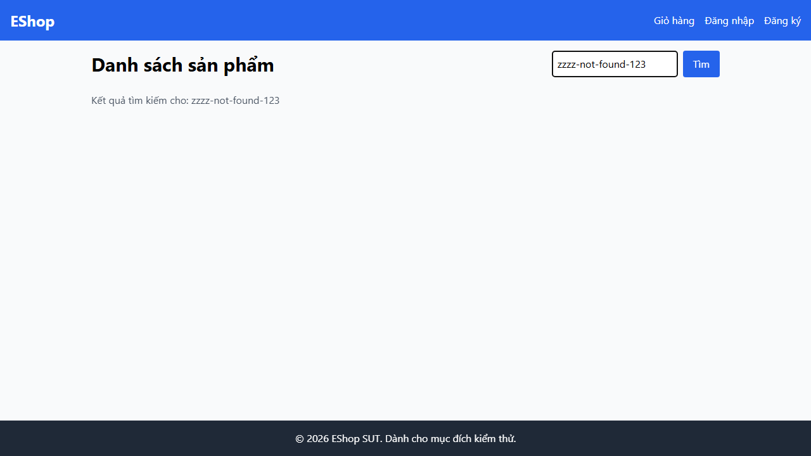
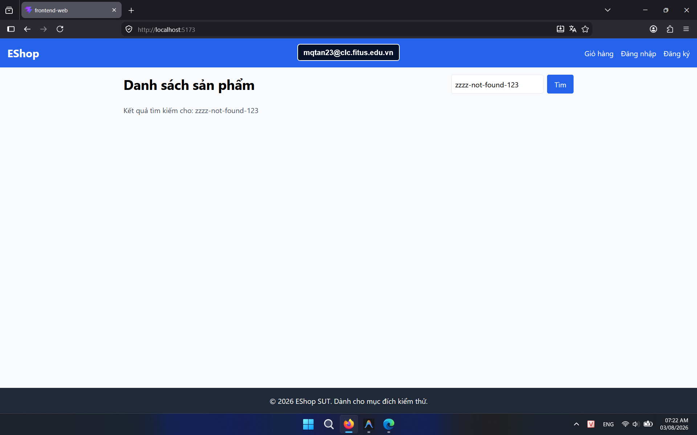

## Found by Test Case

HOME-GUI-IA04-032

## Requirement liên quan

FR-05, FR-24

## Severity / Priority

Minor / P3

## Environment

- Browser: Google Chrome (Windows 11)
- Browser: Mozilla Firefox (Windows 11)

URL: `http://localhost:5173` (hoặc local Metro Bundler với di động)

## Steps to reproduce

1. Mở trang Home.
2. Tìm một từ khóa không có kết quả.
3. Quan sát phần nội dung thay thế cho danh sách sản phẩm.

## Expected result

Trang phải hiển thị empty state thân thiện với icon/hình minh họa và thông điệp rõ ràng.

## Actual result

Không có empty state thân thiện như yêu cầu.

## Console / Repro

```javascript
const input = document.querySelector('input[type="text"]');
input.value = 'zzzz-not-found-123';
input.dispatchEvent(new Event('input', { bubbles: true }));
input.closest('form').requestSubmit();
```

## Evidence

- **Ảnh chụp lỗi trên Google Chrome:** 
- **Ảnh chụp lỗi trên Firefox:** 
