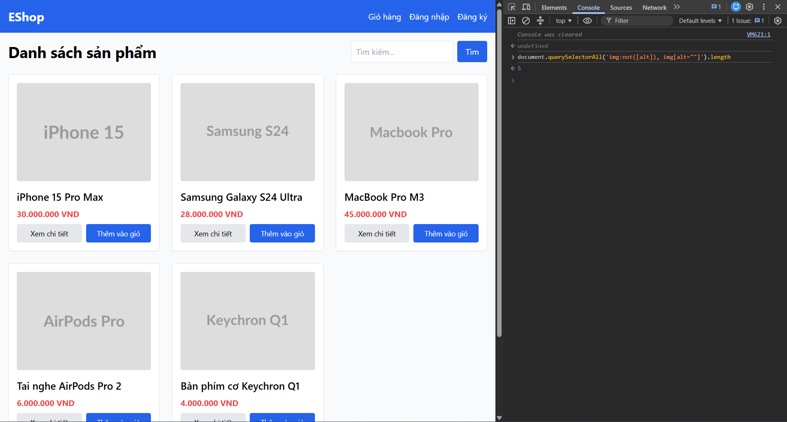

## Found by Test Case

HOME-GUI-IA04-034

## Requirement liên quan

FR-05, FR-24, WCAG

## Severity / Priority

Minor / P2

## Environment

Browser: Google Chrome / Microsoft Edge, OS: Windows, URL: `http://localhost:5173`

## Steps to reproduce

1. Mở trang Home.
2. Quan sát một product card bất kỳ trong danh sách sản phẩm.
3. Kiểm tra thuộc tính `alt` của ảnh sản phẩm.

## Expected result

Mỗi ảnh sản phẩm phải có `alt` mô tả rõ nội dung ảnh để hỗ trợ screen reader và
trợ năng.

## Actual result

Ảnh sản phẩm đang dùng `alt=""`, nên người dùng dùng screen reader không nhận
được mô tả nào cho hình ảnh.

## Evidence

- **HOME-GUI-IA04-034 (Ảnh 1: Home page với product grid):**
  
