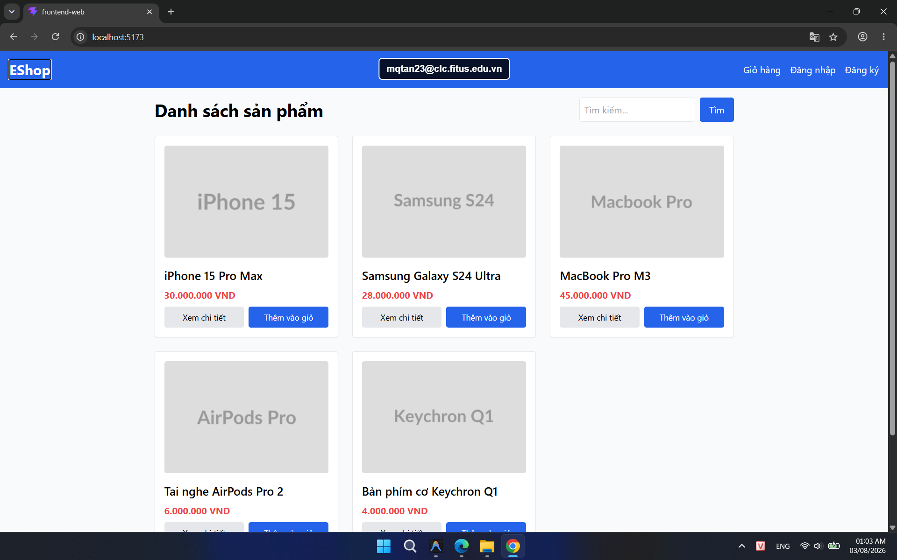
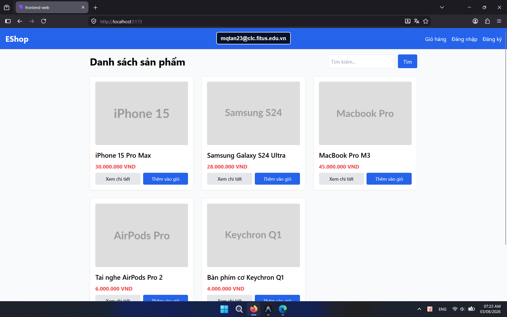

## Found by Test Case

HOME-GUI-IA04-035

## Requirement liên quan

FR-05, FR-21

## Severity / Priority

Minor / P3

## Environment

- Browser: Google Chrome (Windows 11)
- Browser: Mozilla Firefox (Windows 11)

URL: `http://localhost:5173` (hoặc local Metro Bundler với di động)

## Steps to reproduce

1. Mở trang Home.
2. Quan sát giá trên các product card.
3. Kiểm tra ký hiệu tiền tệ đang hiển thị.

## Expected result

Giá phải có ký hiệu `₫` và định dạng hàng nghìn thống nhất.

## Actual result

Giá sản phẩm vẫn đang hiển thị theo dạng `VND`, chưa đúng ký hiệu yêu cầu.

## Console / Repro

```javascript
document.querySelector('main .grid .text-red-500')?.textContent
```

## Evidence

- **Ảnh chụp lỗi trên Google Chrome:** 
- **Ảnh chụp lỗi trên Firefox:** 
