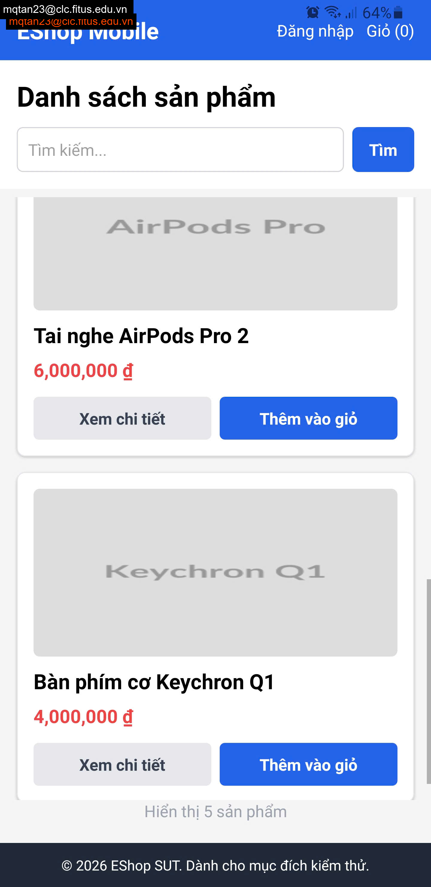

## Found by Test Case

HOME-GUI-IA04-037

## Requirement liên quan

FR-05

## Severity / Priority

Minor / P2

## Environment

- Browser: Google Chrome (Windows 11)
- Device: Samsung Galaxy S9+ (Android 10) / App: Expo Go (React Native)

URL: `http://localhost:5173` (hoặc local Metro Bundler với di động)

## Steps to reproduce

1. Mở ứng dụng di động EShop qua Expo Go.
2. Quan sát danh sách sản phẩm hiển thị trên trang Home.
3. Chú ý tỷ lệ hình ảnh của các sản phẩm (đặc biệt là các sản phẩm có tỷ lệ chiều ngang lớn hoặc chiều dọc lớn).

## Expected result

Hình ảnh sản phẩm phải hiển thị đúng tỷ lệ khung hình gốc, không bị co giãn, méo hoặc biến dạng (distort) bất thường.

## Actual result

Ảnh sản phẩm bị kéo giãn dọc/ngang để lấp đầy khung ảnh, làm biến dạng nghiêm trọng tỷ lệ gốc của sản phẩm.

## Console / Repro

```javascript
// Dòng 457-461 trong frontend-mobile/App.js sử dụng thuộc tính resizeMode="stretch"
<Image
  source={{ uri: item.imageUrl }}
  style={styles.productImage}
  resizeMode="stretch" // Làm biến dạng tỷ lệ gốc của ảnh sản phẩm
/>
```

## Evidence

- **Ảnh chụp danh sách sản phẩm bị biến dạng tỷ lệ trên Mobile:** 
