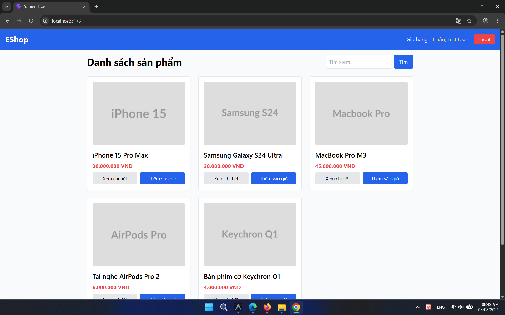
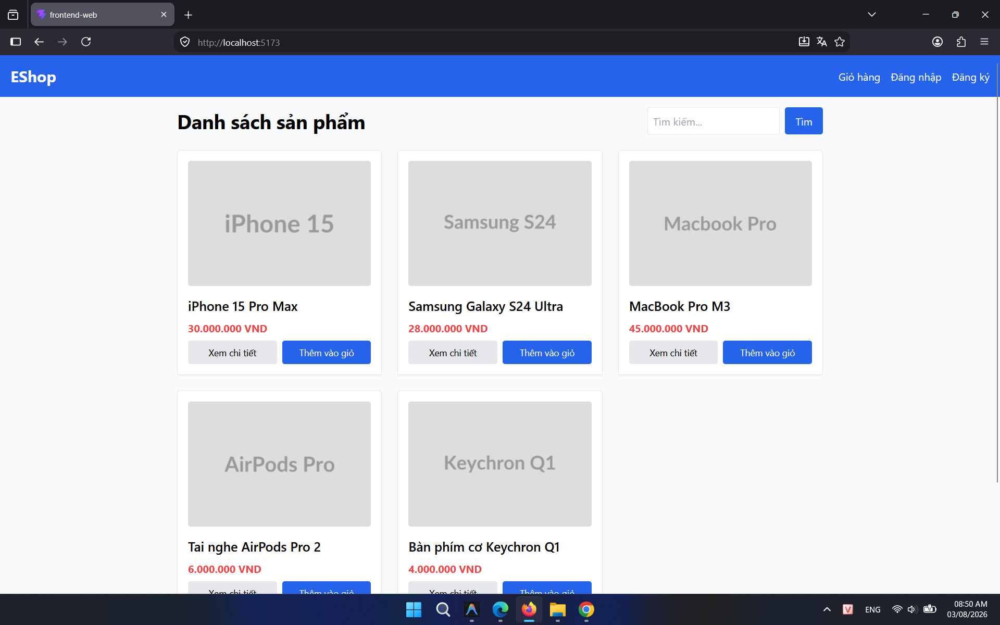

## Found by Test Case

HOME-GUI-IA04-038

## Requirement liên quan

FR-05, FR-21

## Severity / Priority

Minor / P3

## Environment

- Browser: Google Chrome (Windows 11)
- Browser: Mozilla Firefox (Windows 11)

URL: `http://localhost:5173` (hoặc local Metro Bundler với di động)

## Steps to reproduce

1. Mở trang Home (`http://localhost:5173`).
2. Di chuyển chuột vào bất kỳ product card nào trong grid danh sách sản phẩm.
3. Quan sát bề mặt card (phần border, shadow, màu nền) khi hover.

## Expected result

Khi hover lên product card, bản thân card phải có phản hồi trực quan rõ ràng, ví dụ shadow nổi hơn (`hover:shadow-md`), màu nền thay đổi nhẹ, hoặc scale nhỏ — giúp người dùng nhận biết card đó có thể click được.

## Actual result

Bản thân card không có bất kỳ hiệu ứng hover nào (shadow, màu, scale đều không đổi). Chỉ hai nút **Xem chi tiết** và **Thêm vào giỏ** bên trong card mới đổi màu khi hover, còn vùng card chính (tên, ảnh, giá) hoàn toàn không phản hồi.

## Console / Repro

```javascript
// Kiểm tra class của product card
document.querySelector('.border.rounded.shadow-sm')?.className;
// Không có hover:shadow-* hay hover:scale-* hay hover:bg-* trong class card
```

## Evidence

- **Ảnh chụp card khi hover (Chrome):** 
- **Ảnh chụp card bình thường để so sánh:** 
