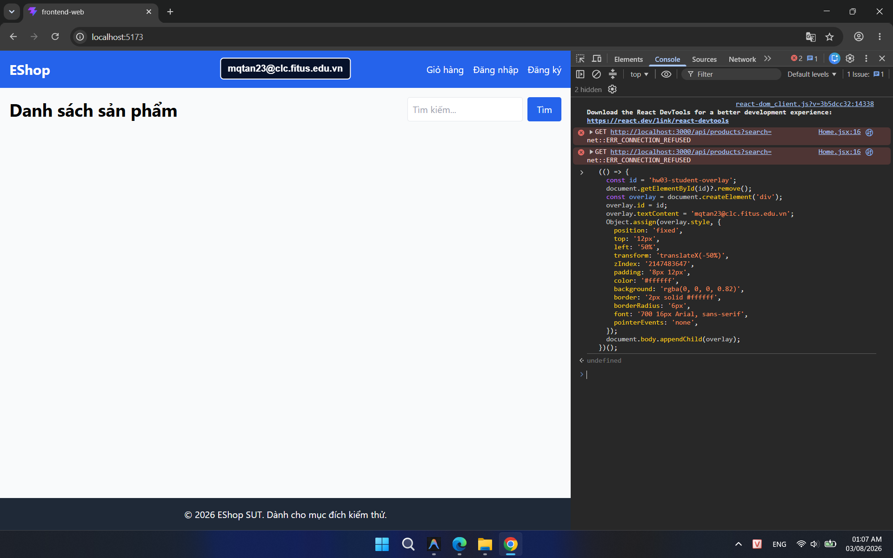
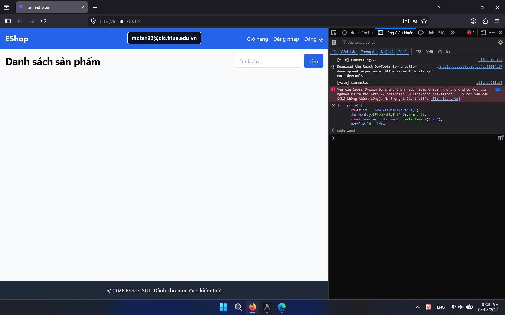

## Found by Test Case

HOME-GUI-IA04-041

## Requirement liên quan

Nielsen #9 Help users recognize errors

## Severity / Priority

Major / P1

## Environment

- Browser: Google Chrome (Windows 11)
- Browser: Mozilla Firefox (Windows 11)

URL: `http://localhost:5173` (hoặc local Metro Bundler với di động)

## Steps to reproduce

1. Mở trang Home.
2. Gây lỗi hoặc mất kết nối khi tải danh sách sản phẩm.
3. Quan sát phản hồi trên màn hình.

## Expected result

Trang phải hiển thị thông báo lỗi rõ ràng thay vì để người dùng nhìn thấy màn hình trống.

## Actual result

Không có thông báo lỗi rõ ràng khi request sản phẩm thất bại.

## Console / Repro

```javascript
Open DevTools > Network, set throttling to `Offline`, then reload Home.
```

## Evidence

- **Ảnh chụp lỗi trên Google Chrome:** 
- **Ảnh chụp lỗi trên Firefox:** 

## GitHub Issue

https://github.com/yuran1811/hcmus-sw-testing--eshop-sut/issues/192
