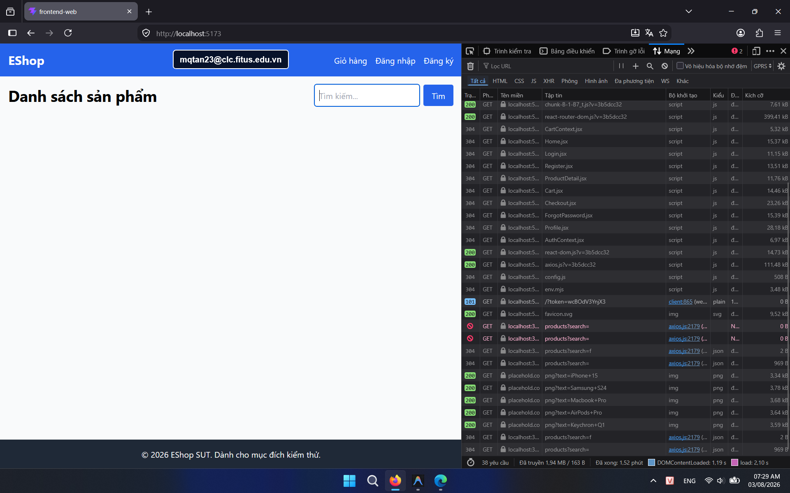

## Found by Test Case

HOME-GUI-IA04-044

## Also observed by Usability Finding

[F10 — Sessions P03, P04, P06](../../../../usability-tests/U-001/4_reports-synthesis/usability_evaluation_report.md#5-findings)

## Requirement liên quan

N/A

## Severity / Priority

Major / P1

## Environment

- Browser: Google Chrome (Windows 11)
- Browser: Mozilla Firefox (Windows 11)

URL: `http://localhost:5173` (hoặc local Metro Bundler với di động)

## Steps to reproduce

1. Mở trang Home.
2. Làm chậm request tải sản phẩm.
3. Quan sát phản hồi trong lúc chờ.

## Expected result

Khi request chậm, Home phải cho người dùng thấy trạng thái chờ hoặc lỗi rõ ràng.

## Actual result

Trang không hiển thị phản hồi chờ rõ ràng cho request chậm.

## Console / Repro

```javascript
Open DevTools > Network, set throttling to `Slow 3G`, then reload Home and watch for feedback.
```

## Evidence

- **Ảnh chụp lỗi trên Google Chrome:** 
- **Ảnh chụp lỗi trên Firefox:** 
- [U-001 bug index & evidence — F10](../../../../usability-tests/U-001/5_evidence/bug_index.md#finding-evidence)

## GitHub Issue

https://github.com/yuran1811/hcmus-sw-testing--eshop-sut/issues/193
