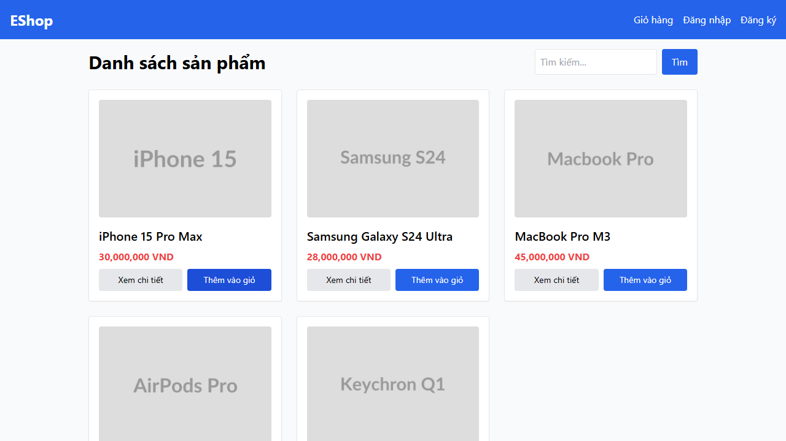

## Found by Test Case

HOME-GUI-IA03-022

## Requirement liên quan

FR-23

## Severity / Priority

Minor / P3

## Environment

Browser: Google Chrome / Microsoft Edge, OS: Windows, URL: `http://localhost:5173`

## Steps to reproduce

1. Mở trang Home.
2. Thêm một sản phẩm vào giỏ hàng.
3. Quan sát link Giỏ hàng trên header.

## Expected result

Link Giỏ hàng phải hiển thị badge số lượng sản phẩm trong giỏ.

## Actual result

Header không hiển thị badge số lượng trên link Giỏ hàng.

## Console / Repro

```text
[...document.querySelectorAll('button')].find((b) => b.textContent.includes('Thêm vào giỏ'))?.click();
document.querySelector('a[href="/cart"]')?.textContent;
```

## Evidence

- 
