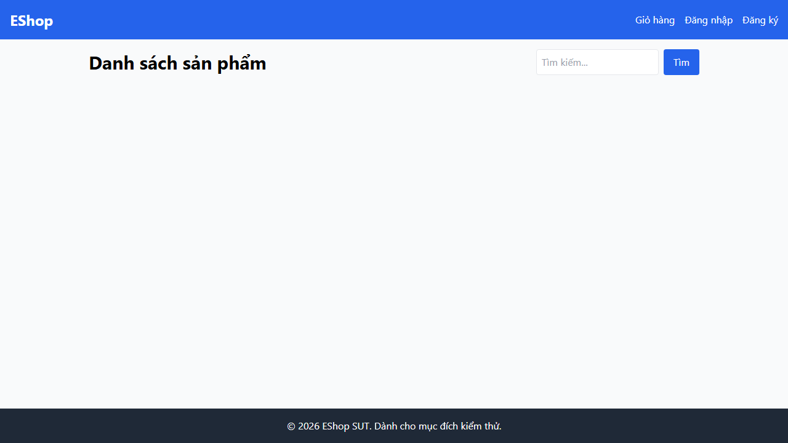

## Found by Test Case

HOME-GUI-IA04-031

## Requirement liên quan

FR-05, Nielsen #1 Visibility

## Severity / Priority

Major / P2

## Environment

Browser: Google Chrome / Microsoft Edge, OS: Windows, URL: `http://localhost:5173`

## Steps to reproduce

1. Mở trang Home.
2. Quan sát lúc danh sách sản phẩm đang được tải.
3. Tìm loading indicator trên màn hình.

## Expected result

Trang phải hiển thị loading state như spinner hoặc skeleton card.

## Actual result

Không có loading state rõ ràng khi danh sách sản phẩm đang tải.

## Console / Repro

```text
Open DevTools > Network, set throttling to `Slow 3G`, then reload Home.
```

## Evidence

- 
