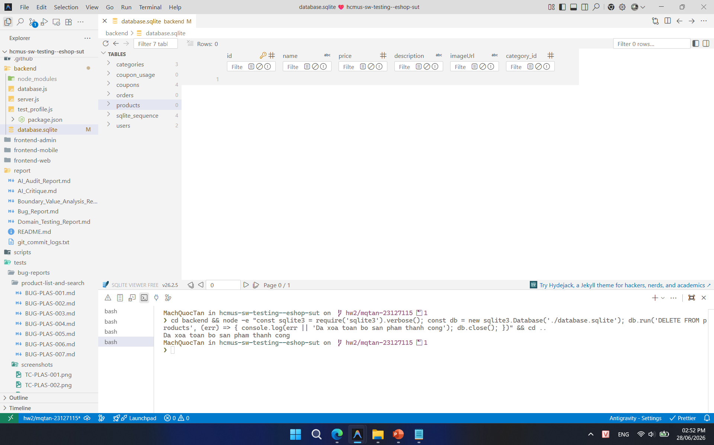
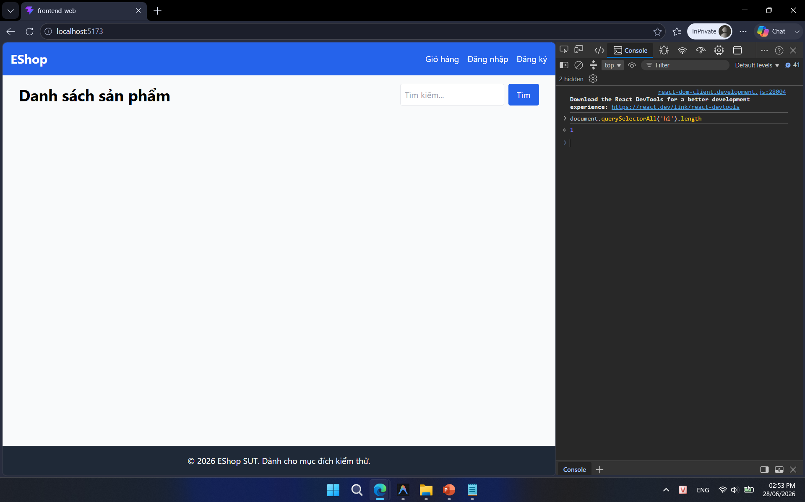

## Found by Test Case

TC-PLAS-003, TC-PLAS-BVA-004

## Requirement liên quan

FR-05 (Xem danh sách & Tìm kiếm sản phẩm)

## Severity / Priority

Minor / P2

## Environment

Browser: Google Chrome / Microsoft Edge, OS: Windows, URL: http://localhost:5173

## Steps to reproduce

**Trường hợp 1 (Tìm kiếm không có kết quả):**
1. Truy cập trang chủ EShop (`http://localhost:5173`).
2. Nhập từ khóa không tồn tại vào thanh tìm kiếm (Ví dụ: `"NonExistentProduct12345"`).
3. Bấm nút Tìm kiếm (hoặc nhấn Enter).
4. Quan sát giao diện khu vực hiển thị sản phẩm.

**Trường hợp 2 (Cơ sở dữ liệu trống sản phẩm):**
1. Xóa toàn bộ sản phẩm khỏi database.
2. Truy cập trang chủ EShop (`http://localhost:5173`).
3. Quan sát giao diện khu vực hiển thị sản phẩm.

## Expected result

Lưới sản phẩm trống và phải hiển thị một thông báo phản hồi (empty state) phù hợp (ví dụ: "Không tìm thấy sản phẩm nào" hoặc "Chưa có sản phẩm nào được đăng bán").

## Actual result

Lưới sản phẩm trống nhưng hoàn toàn không hiển thị bất kỳ thông báo hay thông tin phản hồi empty state nào trên màn hình (trắng trơn).

## Evidence

- **TC-PLAS-003 (Tìm kiếm không kết quả):**
  
- **TC-PLAS-BVA-004 (Xóa hết sản phẩm):**
  
- **TC-PLAS-BVA-004 (Kết quả trắng trơn):**
  
