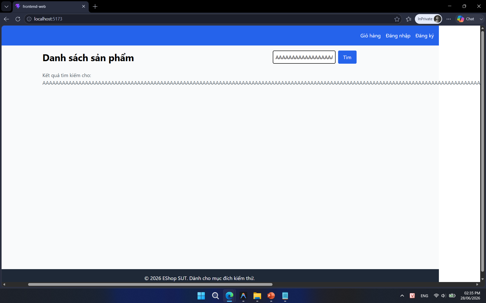
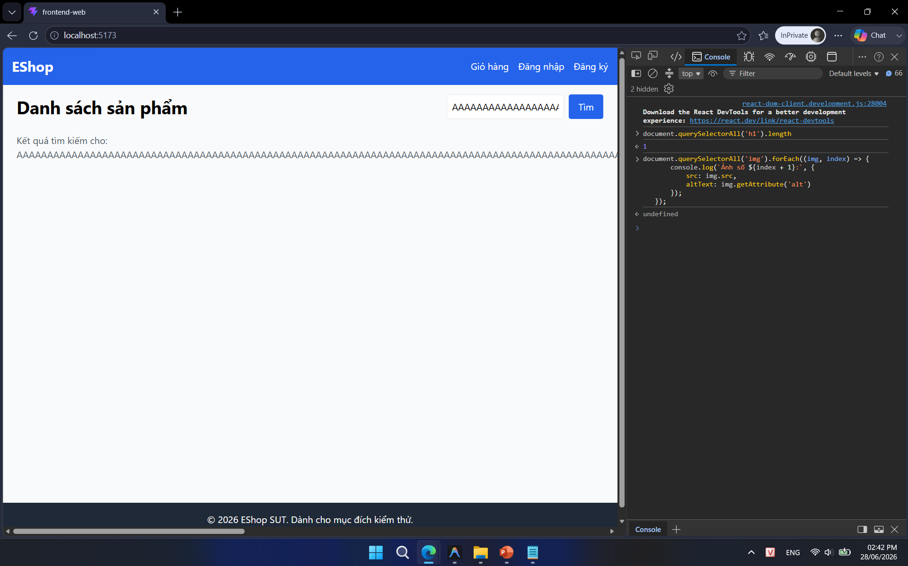

## Found by Test Case

TC-PLAS-BVA-002, TC-PLAS-BVA-003

## Requirement liên quan

FR-05 (Xem danh sách & Tìm kiếm sản phẩm)

## Severity / Priority

Cosmetic / P3

## Environment

Browser: Google Chrome / Microsoft Edge, OS: Windows, URL: http://localhost:5173

## Steps to reproduce

1. Truy cập trang chủ EShop (`http://localhost:5173`).

2. Nhập từ khóa tìm kiếm dài 255 hoặc 256 ký tự (ví dụ: chuỗi gồm các chữ cái `"A"` liên tục không có dấu cách).

3. Bấm nút Tìm kiếm (hoặc nhấn Enter).

4. Quan sát dòng text kết quả hiển thị: *"Kết quả tìm kiếm cho: AAAAA..."*.

## Expected result

Khi hệ thống chấp nhận và phản chiếu từ khóa dài, chuỗi phải được ngắt dòng hoặc rút gọn an toàn để không tràn khung và không tạo thanh cuộn ngang. FR-05 không quy định độ dài tối đa; `255/256` chỉ là dữ liệu robustness tham chiếu, nên việc không có `maxlength=255` tự nó không phải lỗi.

## Actual result

Dòng chữ kết quả tìm kiếm được phản chiếu nhưng không ngắt/rút gọn, tràn khỏi biên giao diện chính và tạo thanh cuộn ngang gây vỡ bố cục.

## Evidence

- **TC-PLAS-BVA-002 (Vỡ giao diện khi từ khóa quá dài - 255 ký tự):**
  
- **TC-PLAS-BVA-003 (Vỡ giao diện khi từ khóa quá dài - 256 ký tự):**
  
