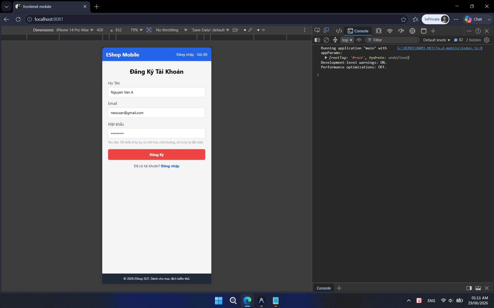

## Found by Test Case

TC-MOBILE-REGISTER-001, TC-MOBILE-REGISTER-002, TC-MOBILE-REGISTER-003, TC-MOBILE-REGISTER-004, TC-MOBILE-REGISTER-005, TC-MOBILE-REGISTER-006, TC-MOBILE-REGISTER-007, TC-MOBILE-REGISTER-008, TC-MOBILE-REGISTER-009, TC-MOBILE-REGISTER-010, TC-MOBILE-REGISTER-011, TC-MOBILE-REGISTER-012, TC-MOBILE-REGISTER-013, TC-MOBILE-REGISTER-BVA-001, TC-MOBILE-REGISTER-BVA-002

## Requirement liên quan

FR-01 (Đăng ký tài khoản)

## Severity / Priority

Major / P1

## Environment

Browser: Chrome, Edge, Mobile Chrome, Mobile Safari, OS: Windows, Android, iOS, URL: http://localhost:8081

## Steps to reproduce

1. Mở ứng dụng Mobile và điều hướng tới trang Đăng ký.

2. Quan sát các trường nhập liệu có trên màn hình đăng ký.

## Expected result

Có đầy đủ 4 trường nhập liệu bao gồm: Họ Tên, Email, Mật khẩu và Xác nhận mật khẩu theo như FR-01.

## Actual result

Chỉ hiển thị 3 trường nhập liệu: Họ Tên, Email, Mật khẩu. Hoàn toàn thiếu trường Xác nhận mật khẩu.

## Evidence

- **TC-MOBILE-REGISTER-001:**
  
