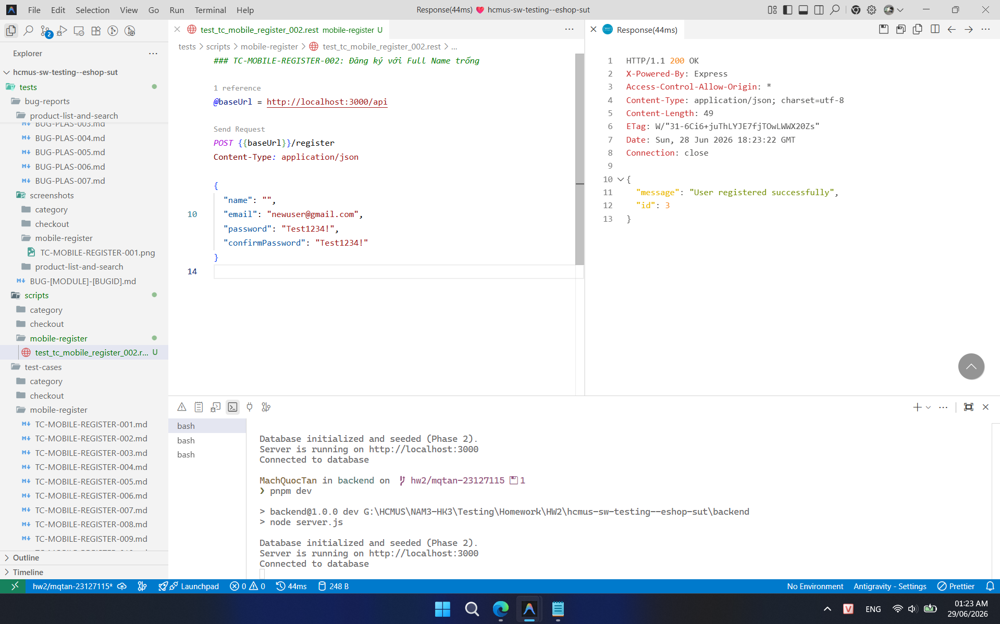
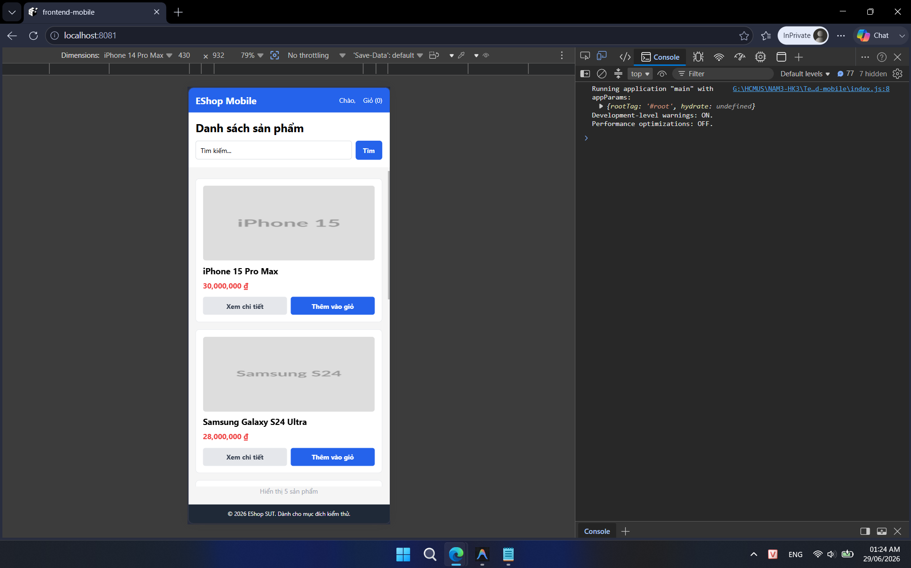

## Found by Test Case

TC-MOBILE-REGISTER-002

## Requirement liên quan

FR-01 (Đăng ký tài khoản)

## Severity / Priority

Major / P1

## Environment

Browser: Chrome, Edge, Mobile Chrome, Mobile Safari, OS: Windows, Android, iOS, URL: http://localhost:8081

## Steps to reproduce

1. Mở ứng dụng Mobile/Web và điều hướng tới trang Đăng ký.

2. Bỏ trống trường Họ Tên (Full Name).

3. Nhập đầy đủ các thông tin hợp lệ khác (Email, Mật khẩu).

4. Bấm nút Đăng ký.

## Expected result

Hệ thống hiển thị lỗi validation yêu cầu nhập Họ Tên, từ chối gửi request hoặc backend trả về mã lỗi 400 và không lưu user vào cơ sở dữ liệu.

## Actual result

Hệ thống vẫn thực hiện đăng ký thành công tài khoản (lưu vào database với trường name rỗng hoặc null) và chuyển hướng/thông báo thành công.

## Evidence

- **TC-MOBILE-REGISTER-002a (Đăng ký thành công không có Họ Tên):**
  
- **TC-MOBILE-REGISTER-002b (Đăng nhập thành công và hiển thị giao diện chào thiếu Họ Tên):**
  
