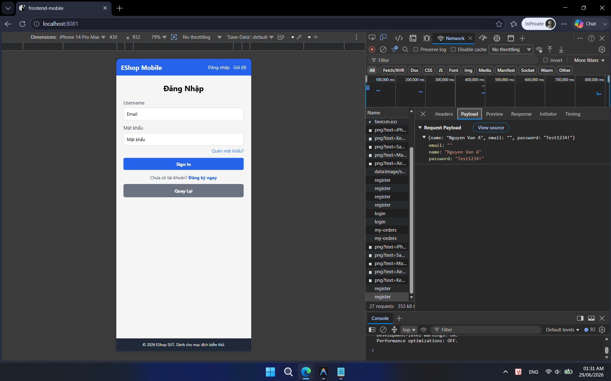
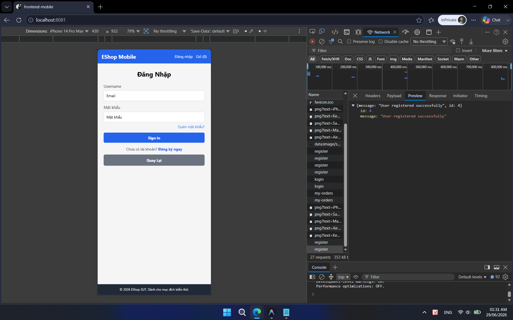

## Found by Test Case

TC-MOBILE-REGISTER-003

## Requirement liên quan

FR-01 (Đăng ký tài khoản)

## Severity / Priority

Major / P1

## Environment

Browser: Chrome, Edge, Mobile Chrome, Mobile Safari, OS: Windows, Android, iOS, URL: http://localhost:8081

## Steps to reproduce

1. Mở ứng dụng Mobile/Web và điều hướng tới trang Đăng ký.

2. Nhập Họ Tên và Mật khẩu.

3. Bỏ trống trường Email.

4. Bấm nút Đăng ký.

## Expected result

Hệ thống từ chối đăng ký và hiển thị lỗi validation yêu cầu nhập Email, backend trả về lỗi và không tạo user.

## Actual result

Hệ thống vẫn đăng ký tài khoản thành công mà không cần Email.

## Evidence

- **TC-MOBILE-REGISTER-003a (Gửi request POST thành công không có Email):**
  
- **TC-MOBILE-REGISTER-003b (Giao diện báo đăng ký thành công):**
  
