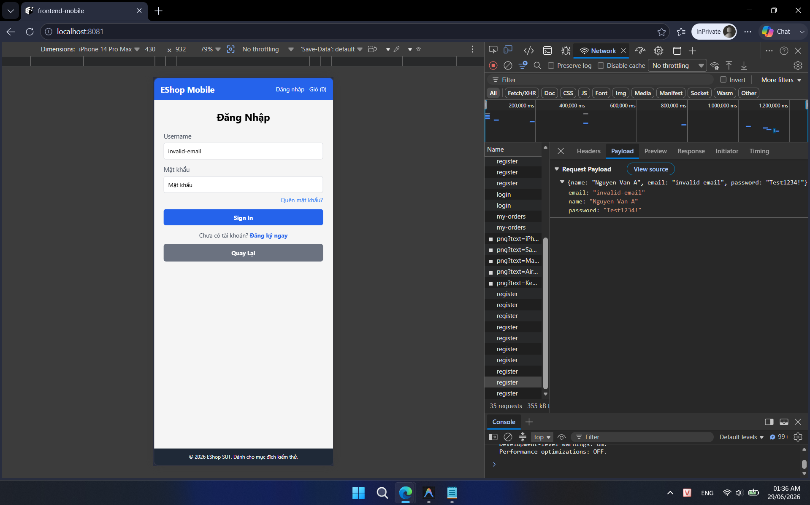
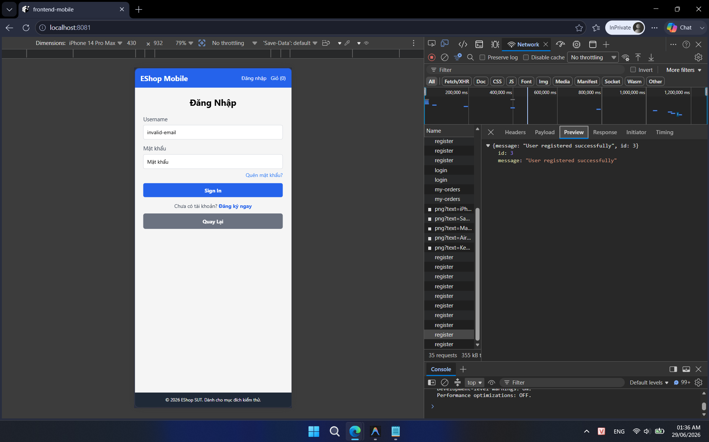

## Found by Test Case

TC-MOBILE-REGISTER-004

## Requirement liên quan

FR-01 (Đăng ký tài khoản)

## Severity / Priority

Major / P1

## Environment

Browser: Chrome, Edge, Mobile Chrome, Mobile Safari, OS: Windows, Android, iOS, URL: http://localhost:8081

## Steps to reproduce

1. Mở ứng dụng Mobile/Web và điều hướng tới trang Đăng ký.

2. Nhập Họ Tên, Mật khẩu.

3. Nhập Email sai định dạng (ví dụ: `invalid-email`).

4. Bấm nút Đăng ký.

## Expected result

Hệ thống từ chối đăng ký và hiển thị lỗi validation yêu cầu nhập đúng định dạng Email (`user@domain.com`), backend trả về lỗi và không lưu user vào cơ sở dữ liệu.

## Actual result

Hệ thống vẫn đăng ký tài khoản thành công mà không báo lỗi gì về định dạng Email.

## Evidence

- **TC-MOBILE-REGISTER-004a (Gửi request POST đăng ký thành công với Email sai định dạng):**
  
- **TC-MOBILE-REGISTER-004b (Giao diện hiển thị đăng ký thành công):**
  
