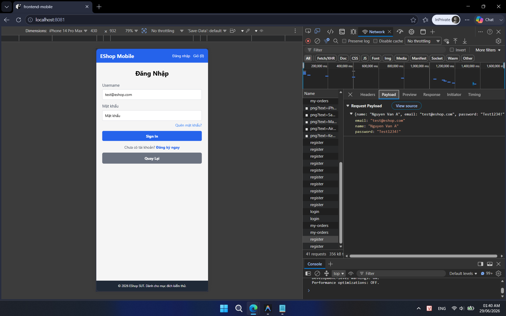
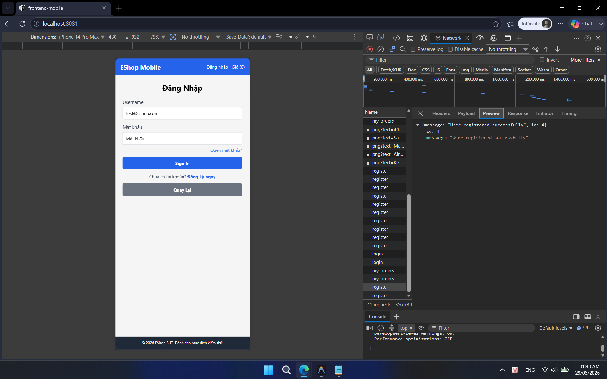

## Found by Test Case

TC-MOBILE-REGISTER-005

## Requirement liên quan

FR-01 (Đăng ký tài khoản)

## Severity / Priority

Major / P1

## Environment

Browser: Chrome, Edge, Mobile Chrome, Mobile Safari, OS: Windows, Android, iOS, URL: http://localhost:8081

## Steps to reproduce

1. Mở ứng dụng Mobile/Web và điều hướng tới trang Đăng ký.

2. Nhập Họ Tên, Mật khẩu.

3. Nhập Email trùng lặp với tài khoản đã tồn tại trong hệ thống (ví dụ: `test@eshop.com`).

4. Bấm nút Đăng ký.

## Expected result

Hệ thống từ chối đăng ký và hiển thị thông báo lỗi rằng Email đã tồn tại/được đăng ký, backend trả về lỗi và không tạo tài khoản mới.

## Actual result

Hệ thống vẫn thực hiện đăng ký tài khoản thành công mà không báo lỗi trùng lặp Email.

## Evidence

- **TC-MOBILE-REGISTER-005a (Gửi request POST thành công với Email đã tồn tại):**
  
- **TC-MOBILE-REGISTER-005b (Giao diện báo đăng ký thành công):**
  
