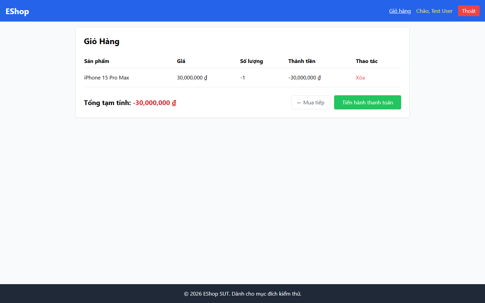
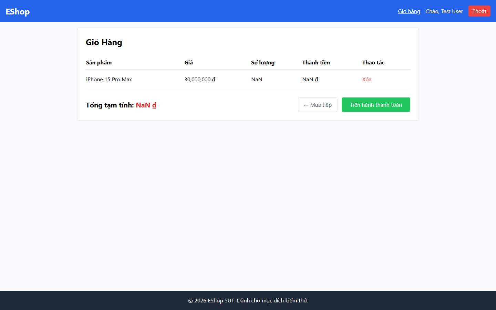
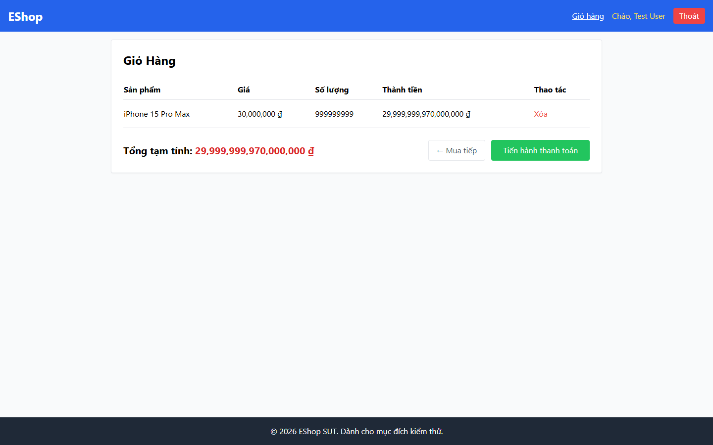

# BUG-PRODDETAIL-002: Ô "Số lượng" không có bất kỳ validation nào (nhận số âm, 0, thập phân, rỗng, ký hiệu mũ, giá trị tràn)

## Found by Test Case

PRODDETAIL-VAL-01 → PRODDETAIL-VAL-10 (GUI Checklist — Product Detail)

## Requirement liên quan

FR-06 (Xem chi tiết sản phẩm — ô nhập **Số lượng** chỉ nhận số nguyên dương, tối thiểu là 1)

## Severity / Priority

Critical / P0

## Environment

- Browser: Chromium (Playwright MCP), viewport 1440×900
- OS: Windows 11
- URL: http://localhost:5173/product/1
- Build: nhánh `hw3/23127211`, commit `ff96609`

## Steps to reproduce

> Lưu ý: do `BUG-PRODDETAIL-001`, phải bấm nút "Thêm vào giỏ hàng" **hai lần** thì thao tác thêm mới thực sự chạy. Các bước dưới đây đã tính tới điều đó.

**Kịch bản 1 — Số lượng âm (VAL-01):**

1. Mở `/product/1`, xoá ô Số lượng và nhập `-1`
2. Bấm "Thêm vào giỏ hàng" hai lần
3. Mở trang Giỏ hàng

**Kịch bản 2 — Số lượng bằng 0 (VAL-02):**

1. Tương tự, nhập `0`

**Kịch bản 3 — Số thập phân (VAL-03):**

1. Tương tự, nhập `1.5`

**Kịch bản 4 — Bỏ trống (VAL-04, VAL-05):**

1. Tương tự, xoá trắng ô Số lượng (hoặc gõ `abc` — ô sẽ tự thành rỗng)

**Kịch bản 5 — Ký hiệu mũ (VAL-06):**

1. Tương tự, nhập `2e3`

**Kịch bản 6 — Giá trị tràn (VAL-07):**

1. Tương tự, nhập `999999999`

**Kịch bản 7 — Mũi tên giảm (VAL-09):**

1. Với giá trị đang là `1`, bấm mũi tên giảm của ô số lượng

**Kịch bản 8 — Dán giá trị âm (VAL-10):**

1. Dán chuỗi `-5` vào ô Số lượng rồi thêm vào giỏ

## Expected result

- VAL-01: Hiện thông báo lỗi ngay dưới ô Số lượng; sản phẩm không được thêm vào giỏ
- VAL-02: Hiện thông báo lỗi yêu cầu số lượng tối thiểu là 1; sản phẩm không được thêm vào giỏ
- VAL-03: Hệ thống từ chối giá trị thập phân và báo số lượng phải là số nguyên; giỏ hàng không nhận `1.5`
- VAL-04: Hiện thông báo bắt buộc nhập số lượng; giỏ hàng không nhận giá trị rỗng hay `NaN`
- VAL-05: Ô nhập không nhận ký tự chữ; giá trị hiển thị vẫn là số hợp lệ trước đó
- VAL-06: Hệ thống từ chối ký hiệu mũ và báo lỗi; giỏ hàng không nhận giá trị 2000
- VAL-07: Hệ thống chặn theo giới hạn số lượng tối đa và báo rõ giới hạn đó cho người dùng
- VAL-08: Ô nhập khai báo `min="1"` và `step="1"` để trình duyệt chặn giá trị không hợp lệ ngay từ đầu
- VAL-09: Giá trị dừng lại ở `1`, không giảm xuống `0` hay số âm
- VAL-10: Giá trị âm bị chặn giống như khi gõ tay; hiện thông báo lỗi và không thêm vào giỏ

## Actual result

**Không có bất kỳ validation nào** — cả 10 kịch bản đều được chấp nhận, không có thông báo lỗi nào xuất hiện trên màn hình:

| Giá trị nhập | Số lượng vào giỏ | Thành tiền hiển thị       | Ghi chú                                            |
| ------------ | ---------------- | ------------------------- | -------------------------------------------------- |
| `-1`         | `-1`             | **-30.000.000 ₫**         | Tổng tạm tính âm                                   |
| `0`          | `0`              | `0 ₫`                     | Dòng rác trong giỏ                                 |
| `1.5`        | `1`              | `30.000.000 ₫`            | `parseInt` âm thầm cắt còn 1, người dùng không biết |
| (rỗng)       | `NaN`            | **`NaN ₫`**               | Tổng tạm tính cũng thành `NaN ₫`                   |
| `abc`        | `NaN`            | **`NaN ₫`**               | Ô chặn chữ nhưng xoá luôn giá trị cũ thành rỗng    |
| `2e3`        | `2`              | `60.000.000 ₫`            | `valueAsNumber`=2000 nhưng `parseInt("2e3")`=2     |
| `999999999`  | `999999999`      | **29.999.999.970.000.000 ₫** | Không có giới hạn tối đa                        |
| `-5` (paste) | `-5`             | **-150.000.000 ₫**        | Dán cũng không bị chặn                             |

Bổ sung:

- **VAL-08:** DOM thực tế là `<input class="border p-2 w-20 rounded" type="number" value="1">` — không có `min`, `max`, `step` (cũng không có `id`/`name`).
- **VAL-09:** Từ `1` bấm mũi tên giảm → giá trị về `0`, vì thiếu `min="1"` nên trình duyệt không có mốc chặn.
- **VAL-03:** Trình duyệt đã tự đánh dấu `validity.valid = false` (stepMismatch) nhưng ứng dụng **không đọc tới** cờ này và cũng không chặn submit.

## Evidence

- Screenshot (số lượng âm → tổng tiền -30.000.000 ₫): 
- Screenshot (số lượng 0): 
- Screenshot (bỏ trống → `NaN ₫`): 
- Screenshot (999999999 → tổng tiền tràn): 

## Notes

Đây là lỗi chạm trực tiếp tới tiền: số lượng âm tạo ra tổng tiền âm, giá trị rỗng tạo ra `NaN ₫` lan sang cả trang Giỏ hàng và (nhiều khả năng) cả bước Checkout. Cần validate ở **cả frontend lẫn backend** — không chỉ thêm `min`/`step` vào thẻ `<input>`, vì thuộc tính HTML có thể bị bỏ qua khi gọi API trực tiếp.
