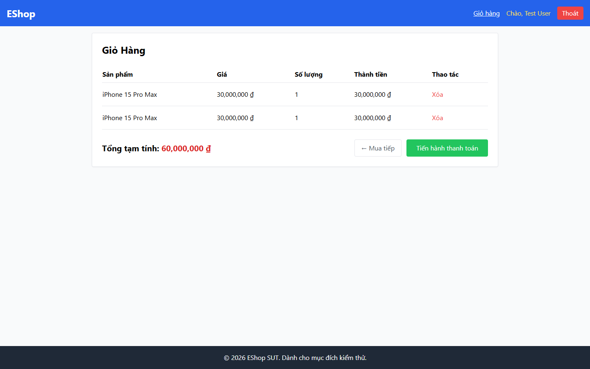

# BUG-PRODDETAIL-003: Thêm cùng một sản phẩm nhiều lượt tạo ra nhiều dòng trùng lặp thay vì cộng dồn số lượng

## Found by Test Case

PRODDETAIL-FUN-04 (GUI Checklist — Product Detail)

## Requirement liên quan

FR-07 (Giỏ hàng — "Thêm cùng một sản phẩm vào giỏ sẽ tăng số lượng, không tạo dòng mới")

## Severity / Priority

Major / P1

## Environment

- Browser: Chromium (Playwright MCP), viewport 1440×900
- OS: Windows 11
- URL: http://localhost:5173/product/1
- Build: nhánh `hw3/23127211`, commit `ff96609`

## Steps to reproduce

1. Mở `http://localhost:5173/product/1`
2. Thực hiện lượt thêm thứ nhất: bấm "Thêm vào giỏ hàng" hai lần (do `BUG-PRODDETAIL-001`), chờ nhãn "Đã thêm" trở về nhãn gốc
3. Thực hiện lượt thêm thứ hai: bấm "Thêm vào giỏ hàng" hai lần nữa
4. Bấm link "Giỏ hàng" trên header

## Expected result

Giỏ hàng gộp thành 1 dòng với số lượng cộng dồn, không tạo 2 dòng trùng tên sản phẩm.

## Actual result

Giỏ hàng tạo ra **2 dòng riêng biệt** cùng tên "iPhone 15 Pro Max", mỗi dòng số lượng `1`:

| Sản phẩm          | Giá            | Số lượng | Thành tiền     |
| ----------------- | -------------- | -------- | -------------- |
| iPhone 15 Pro Max | 30,000,000 ₫   | 1        | 30,000,000 ₫   |
| iPhone 15 Pro Max | 30,000,000 ₫   | 1        | 30,000,000 ₫   |

Nguyên nhân trong `frontend-web/src/context/CartContext.jsx`:

```js
const addToCart = (product, quantity) => {
  setCart([...cart, { ...product, quantity }]);
};
```

Hàm luôn nối thêm phần tử mới vào mảng, không hề kiểm tra xem `product.id` đã tồn tại trong giỏ hay chưa để cộng dồn `quantity`.

## Evidence

- Screenshot (2 dòng trùng lặp trong giỏ hàng): 

## Notes

Lỗi này làm giỏ hàng phình ra vô hạn khi người dùng thêm cùng một sản phẩm nhiều lần, gây khó khăn khi chỉnh sửa số lượng và khi đối soát đơn hàng. Cách sửa: trong `addToCart`, tìm phần tử có cùng `id`; nếu có thì cộng `quantity`, nếu không thì mới `push` dòng mới.
