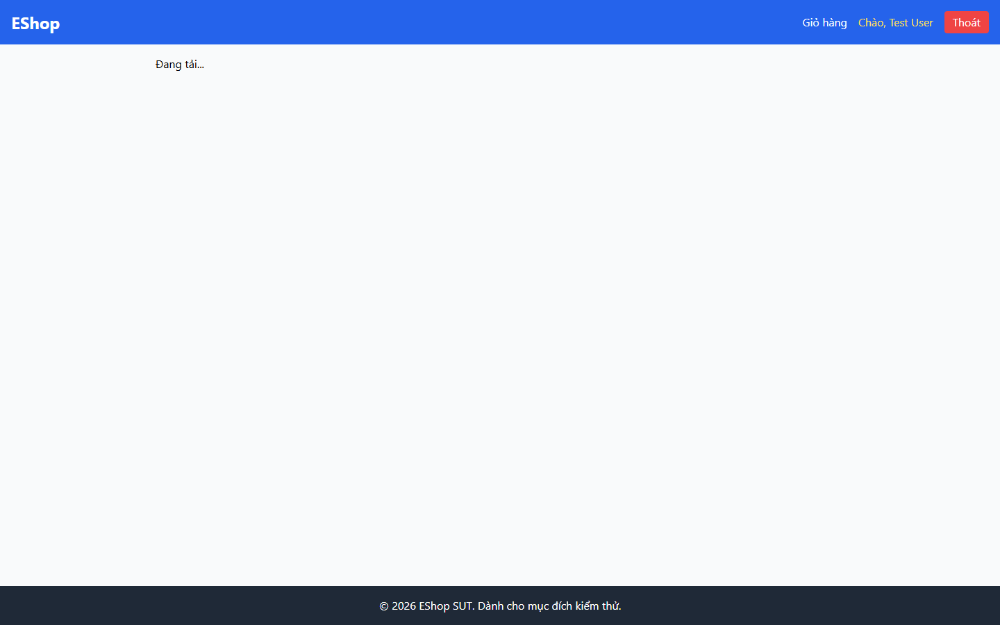

# BUG-PRODDETAIL-004: Màn hình kẹt vĩnh viễn ở "Đang tải..." khi API lỗi; không có trạng thái lỗi và không có chỉ báo tải thị giác

## Found by Test Case

PRODDETAIL-FDB-01, PRODDETAIL-FDB-02 (GUI Checklist — Product Detail)

## Requirement liên quan

FR-06 (Xem chi tiết sản phẩm — hiển thị đầy đủ thông tin sản phẩm cho người dùng)

## Severity / Priority

Critical / P1

## Environment

- Browser: Chromium (Playwright MCP), viewport 1440×900
- OS: Windows 11
- URL: http://localhost:5173/product/1
- Build: nhánh `hw3/23127211`, commit `ff96609`

## Steps to reproduce

**Kịch bản 1 — Backend chết (FDB-02):**

1. Tắt backend ở cổng 3000 (trong lần chạy này mô phỏng bằng cách chặn request `**/api/products/**` với lỗi `connectionrefused`)
2. Mở `http://localhost:5173/product/1`
3. Chờ 30 giây và quan sát màn hình

**Kịch bản 2 — Mạng chậm (FDB-01):**

1. Làm chậm response của `GET /api/products/1` khoảng 4 giây (tương đương throttle "Slow 3G")
2. Mở `http://localhost:5173/product/1`
3. Quan sát trạng thái màn hình trong lúc chờ dữ liệu

## Expected result

- FDB-02: Hiển thị trạng thái lỗi rõ ràng kèm nút "Thử lại"; màn hình không kẹt vô hạn ở trạng thái đang tải
- FDB-01: Hiển thị chỉ báo đang tải có tính thị giác (spinner/skeleton) thay cho chữ thuần, cho tới khi dữ liệu về

## Actual result

**Kịch bản 1:** Sau **30 giây** màn hình vẫn kẹt nguyên ở dòng chữ "Đang tải...". Kiểm tra DOM tại thời điểm đó:

- Không có thông báo lỗi nào (`/lỗi|error|thử lại|không kết nối/i` không khớp)
- Không có nút nào trong `main` — tức không có nút "Thử lại"
- Màn hình sẽ kẹt như vậy vô thời hạn

**Kịch bản 2:** Trạng thái tải là đúng `<div>Đang tải...</div>` — chữ thuần:

- **0** phần tử spinner / skeleton / `progress` / `role=progressbar`
- **0** phần tử có thuộc tính `animation`

Nguyên nhân trong `frontend-web/src/pages/ProductDetail.jsx`:

```js
axios
  .get(`http://localhost:3000/api/products/${id}`)
  .then((res) => setProduct(res.data))
  .catch((err) => console.error(err)); // chỉ log, không set state lỗi
...
if (!product) return <div>Đang tải...</div>;
```

`.catch()` chỉ ghi log ra console mà không set state lỗi, nên `product` giữ nguyên `null` mãi mãi và nhánh `if (!product)` luôn trả về màn hình "Đang tải...".

## Evidence

- Screenshot (kẹt ở "Đang tải..." khi API lỗi): 

## Notes

Người dùng gặp tình huống này không có cách nào biết chuyện gì đang xảy ra và cũng không có cách nào thử lại ngoài việc tự tải lại trang. Cần bổ sung một state `error` riêng, hiển thị thông báo thân thiện kèm nút "Thử lại", và thay chữ "Đang tải..." bằng spinner hoặc skeleton.
