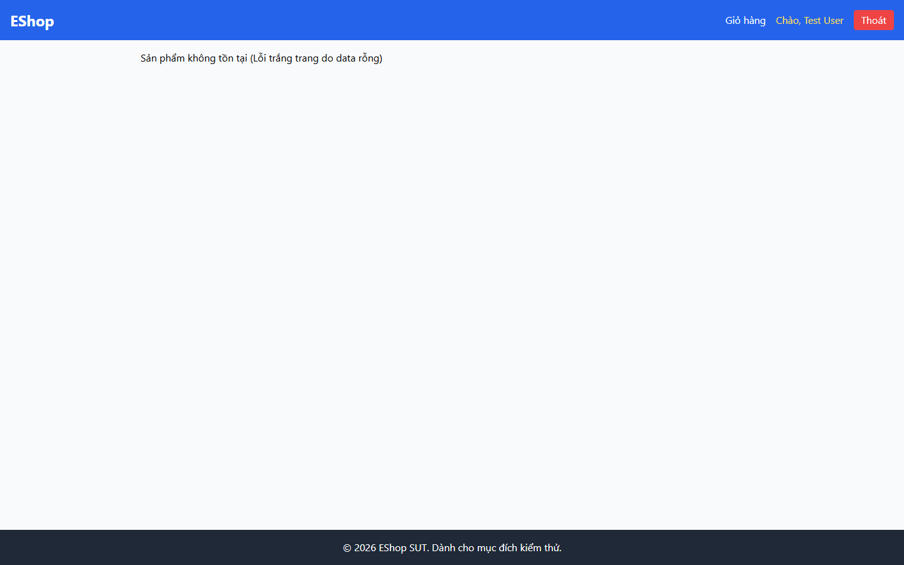

# BUG-PRODDETAIL-005: Thông báo lỗi lộ ghi chú debug của lập trình viên và trang không có lối quay lại danh sách sản phẩm

## Found by Test Case

PRODDETAIL-NAV-06, PRODDETAIL-NAV-07, PRODDETAIL-NAV-08, PRODDETAIL-FDB-03 (GUI Checklist — Product Detail)

## Requirement liên quan

FR-06 (Xem chi tiết sản phẩm), FR-05 (Danh sách sản phẩm — khi không có kết quả phải hiển thị empty state phù hợp)

## Severity / Priority

Major / P1

## Environment

- Browser: Chromium (Playwright MCP), viewport 1440×900
- OS: Windows 11
- URL: http://localhost:5173/product/99999 và http://localhost:5173/product/abc
- Build: nhánh `hw3/23127211`, commit `ff96609`

## Steps to reproduce

**Kịch bản 1 — id không tồn tại (NAV-06, FDB-03):**

1. Mở `http://localhost:5173/product/99999`
2. Đọc nguyên văn thông báo hiển thị cho người dùng
3. Tìm lối quay lại danh sách sản phẩm ngay trong nội dung trang

**Kịch bản 2 — id sai kiểu dữ liệu (NAV-07):**

1. Mở `http://localhost:5173/product/abc`
2. Quan sát cách hệ thống xử lý

**Kịch bản 3 — trang chi tiết hợp lệ (NAV-08):**

1. Mở `http://localhost:5173/product/1`
2. Tìm cách quay lại danh sách sản phẩm **mà không dùng** nút Back của trình duyệt

## Expected result

- NAV-06: Hiển thị thông báo thân thiện với người dùng cuối kèm lối quay lại danh sách sản phẩm
- NAV-07: Xử lý an toàn như trường hợp không tìm thấy sản phẩm; không hiển thị màn hình trắng hay lỗi kỹ thuật
- NAV-08: Trang cung cấp lối quay lại rõ ràng ngay trong nội dung (breadcrumb hoặc link "Quay lại danh sách")
- FDB-03: Thông báo viết cho người dùng cuối, không chứa thuật ngữ debug nội bộ của lập trình viên

## Actual result

**Thông báo lộ ghi chú debug.** Cả `/product/99999` và `/product/abc` đều hiển thị nguyên văn:

```
Sản phẩm không tồn tại (Lỗi trắng trang do data rỗng)
```

Phần trong ngoặc — "Lỗi trắng trang do data rỗng" — là ghi chú nội bộ của lập trình viên (mô tả nguyên nhân kỹ thuật) bị lộ thẳng ra người dùng cuối.

Chuỗi này đến từ `frontend-web/src/pages/ProductDetail.jsx`:

```js
if (Object.keys(product).length === 0)
  return <div>Sản phẩm không tồn tại (Lỗi trắng trang do data rỗng)</div>;
```

**Không có lối quay lại.** Truy vấn `main a` trên cả 3 kịch bản đều trả về **mảng rỗng** — trang không có breadcrumb, không có link "Quay lại danh sách", cũng không có nút nào dẫn về trang chủ. Người dùng rơi vào màn hình lỗi chỉ còn cách dùng nút Back của trình duyệt hoặc bấm logo trên header (nằm ngoài phạm vi nội dung trang).

Riêng NAV-07: hệ thống không trắng trang và không crash (vế "xử lý an toàn" đạt), nhưng vẫn vi phạm vế "không hiển thị lỗi kỹ thuật".

## Evidence

- Screenshot (`/product/99999` — thông báo debug): 
- Screenshot (`/product/abc` — cùng thông báo debug): 

## Notes

Hai vấn đề nên sửa cùng nhau vì đều nằm ở nhánh "không tìm thấy sản phẩm": (1) đổi chuỗi thành thông báo thân thiện, ví dụ "Rất tiếc, sản phẩm bạn tìm không tồn tại hoặc đã ngừng kinh doanh."; (2) bổ sung link "← Quay lại danh sách sản phẩm" ở cả màn hình lỗi lẫn trang chi tiết bình thường (breadcrumb).
