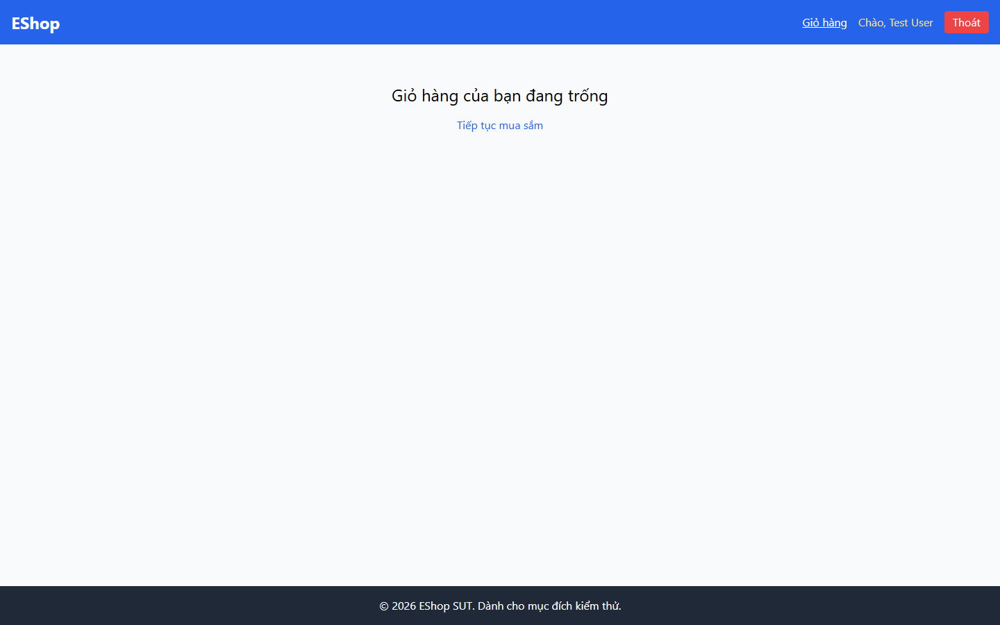

# BUG-PRODDETAIL-006: Giỏ hàng mất sạch sau khi tải lại trang (không được lưu trữ)

## Found by Test Case

PRODDETAIL-NAV-09 (GUI Checklist — Product Detail)

## Requirement liên quan

FR-07 (Giỏ hàng — giỏ hàng phải giữ được sản phẩm người dùng đã thêm)

## Severity / Priority

Major / P1

## Environment

- Browser: Chromium (Playwright MCP), viewport 1440×900
- OS: Windows 11
- URL: http://localhost:5173/product/1
- Build: nhánh `hw3/23127211`, commit `ff96609`

## Steps to reproduce

1. Mở `http://localhost:5173/product/1`
2. Bấm "Thêm vào giỏ hàng" hai lần (do `BUG-PRODDETAIL-001`) — xác nhận nhãn nút đã chuyển sang "Đã thêm"
3. Nhấn `F5` để tải lại trang
4. Bấm link "Giỏ hàng" trên header

## Expected result

Sản phẩm đã thêm vẫn còn trong giỏ sau khi tải lại trang.

## Actual result

Giỏ hàng **trống hoàn toàn** — trang hiển thị "Giỏ hàng của bạn đang trống".

Kiểm tra bộ nhớ trình duyệt ngay sau khi tải lại:

- `Object.keys(localStorage)` → `[]`
- `Object.keys(sessionStorage)` → `[]`

Nguyên nhân trong `frontend-web/src/context/CartContext.jsx`:

```js
const [cart, setCart] = useState([]);
```

Giỏ hàng chỉ tồn tại trong React state, không được đồng bộ xuống `localStorage`/`sessionStorage` cũng không được lưu về backend. Mọi lần tải lại trang (F5, mở lại tab, khôi phục phiên) đều khởi tạo lại giỏ về mảng rỗng.

## Evidence

- Screenshot (giỏ hàng trống sau khi F5): 

## Notes

Đây là hệ quả của kiến trúc chứ không phải lỗi cục bộ ở màn hình Product Detail, nhưng nó phá vỡ trực tiếp hành trình mua hàng: người dùng chọn sản phẩm, vô tình tải lại trang là mất toàn bộ giỏ. Cách sửa tối thiểu: đồng bộ `cart` xuống `localStorage` bằng `useEffect` và khôi phục ở lần khởi tạo state.
