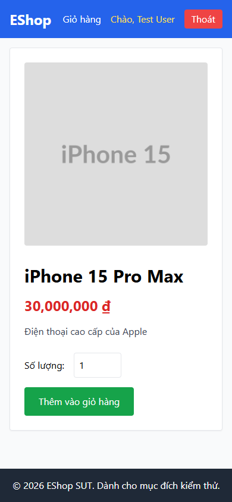

# BUG-PRODDETAIL-007: Nhóm lỗi accessibility — nhãn không liên kết ô nhập, `lang` sai ngôn ngữ, thiếu `aria-live`, vùng chạm dưới chuẩn

## Found by Test Case

PRODDETAIL-ACC-01, PRODDETAIL-ACC-06, PRODDETAIL-ACC-07, PRODDETAIL-ACC-08 (GUI Checklist — Product Detail)

## Requirement liên quan

FR-06 (Xem chi tiết sản phẩm — ô nhập Số lượng và nút Thêm vào giỏ hàng phải dùng được với công nghệ trợ giúp)

## Severity / Priority

Major / P2

## Environment

- Browser: Chromium (Playwright MCP), viewport 1440×900 và 390×844
- OS: Windows 11
- URL: http://localhost:5173/product/1
- Build: nhánh `hw3/23127211`, commit `ff96609`

## Steps to reproduce

**Kịch bản 1 — Nhãn không liên kết ô nhập (ACC-01):**

1. Mở `http://localhost:5173/product/1` ở 1440×900
2. Bấm chuột vào chữ "Số lượng:"
3. Quan sát xem con trỏ có nhảy vào ô nhập số lượng không

**Kịch bản 2 — Thuộc tính `lang` (ACC-06):**

1. Ở cùng trang, kiểm tra thuộc tính `lang` của thẻ `<html>`

**Kịch bản 3 — Thông báo cho screen reader (ACC-07):**

1. Bật screen reader (NVDA hoặc Narrator)
2. Thêm sản phẩm vào giỏ và lắng nghe xem có thông báo thêm thành công không

**Kịch bản 4 — Kích thước vùng chạm (ACC-08):**

1. Chuyển viewport về 390×844
2. Đo kích thước vùng chạm của nút "Thêm vào giỏ hàng" và ô số lượng

## Expected result

- ACC-01: Con trỏ nhảy vào ô nhập số lượng, chứng tỏ nhãn đã được liên kết đúng với ô nhập
- ACC-06: `lang` khai báo `vi` khớp với ngôn ngữ nội dung thực tế của trang
- ACC-07: Screen reader đọc lên thông báo thêm thành công; kết quả thao tác không chỉ thể hiện bằng thị giác
- ACC-08: Cả hai có cạnh ngắn tối thiểu 44 px và cách nhau đủ xa để không bấm nhầm bằng ngón tay

## Actual result

**ACC-01 — Nhãn rời rạc.** DOM thực tế:

```html
<label>Số lượng:</label>
<input class="border p-2 w-20 rounded" type="number" value="1">
```

`<label>` không có thuộc tính `for`, `<input>` không có `id`. Bấm chuột vào chữ "Số lượng:" → `document.activeElement` vẫn là `BODY`, con trỏ không nhảy vào ô nhập. Screen reader cũng không đọc được nhãn khi focus vào ô nhập (ô này cũng không có `aria-label`).

**ACC-06 — Sai ngôn ngữ.** `document.documentElement.lang` = `"en"` trong khi 100% nội dung hiển thị là tiếng Việt ("iPhone 15 Pro Max", "Điện thoại cao cấp của Apple", "Số lượng:", "Thêm vào giỏ hàng"). Screen reader sẽ đọc tiếng Việt bằng bộ phát âm tiếng Anh.

**ACC-07 — Không có thông báo cho screen reader.** Trang có **0** vùng `aria-live`, `role=status` hoặc `role=alert`. Việc nhãn nút đổi từ "Thêm vào giỏ hàng" thành "Đã thêm" là thay đổi thị giác thuần tuý và sẽ không được screen reader thông báo.

> **Ghi chú về phương pháp:** kịch bản 3 chưa chạy được bằng NVDA/Narrator thật (nằm ngoài khả năng của Playwright MCP). Kết luận dựa trên việc đếm live region trong DOM — không có live region thì chắc chắn không có thông báo. Khuyến nghị xác nhận lại bằng screen reader thật trước khi đóng bug.

**ACC-08 — Vùng chạm dưới chuẩn.** Đo ở viewport 390×844:

| Phần tử                   | Kích thước    | Cạnh ngắn | Đạt ≥ 44 px? |
| ------------------------- | ------------- | --------- | ------------ |
| Nút "Thêm vào giỏ hàng"   | 184,3 × 48 px | 48 px     | ✅           |
| Ô nhập số lượng           | 80 × **42** px | **42 px** | ❌           |

Khoảng cách dọc giữa hai vùng chạm là 16 px.

## Evidence

- Screenshot (vùng chạm ở viewport 390×844): 

## Notes

Bốn lỗi được gom chung vì cùng thuộc nhóm accessibility và đều sửa được bằng thay đổi nhỏ, độc lập với logic nghiệp vụ:

1. Thêm `id="quantity"` cho `<input>` và `for="quantity"` cho `<label>`
2. Đổi `<html lang="en">` thành `<html lang="vi">` trong `frontend-web/index.html`
3. Bọc thông báo kết quả trong vùng `role="status"` / `aria-live="polite"`
4. Tăng chiều cao ô nhập lên tối thiểu 44 px (ví dụ đổi `p-2` thành `p-3`)
