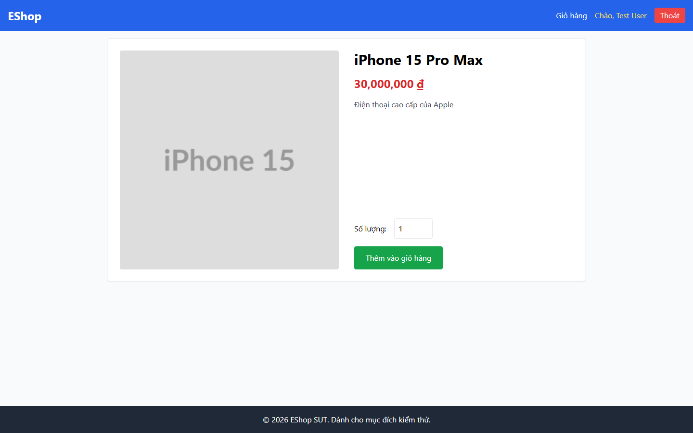
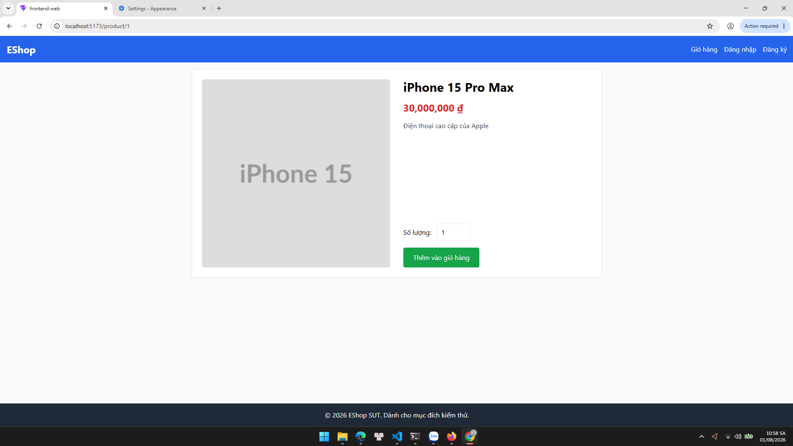
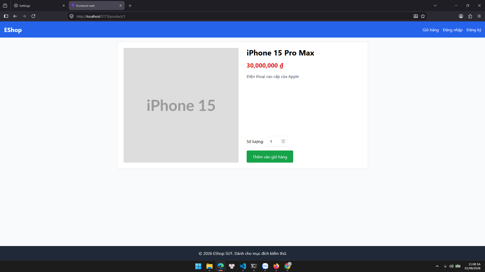
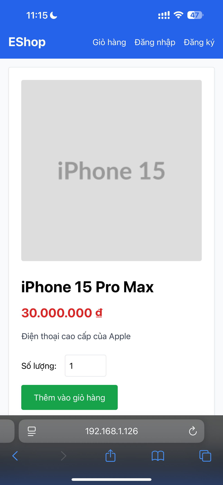
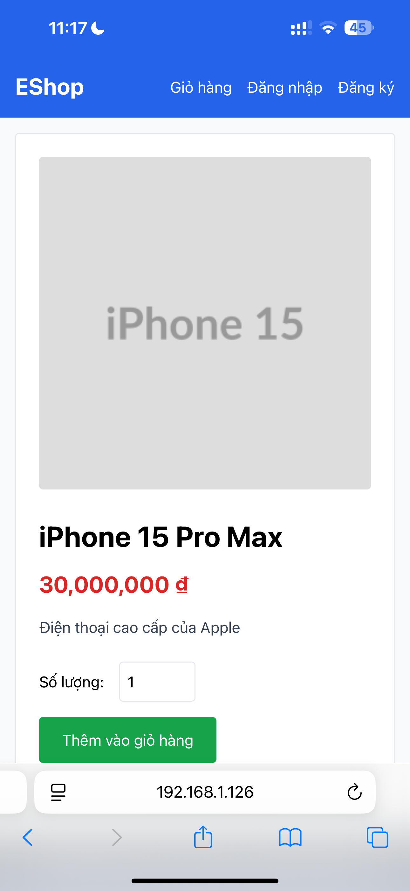

# BUG-PRODDETAIL-008: Định dạng giá phụ thuộc locale trình duyệt thay vì cố định chuẩn tiền tệ Việt Nam

## Found by Test Case

PRODDETAIL-VIS-02, PRODDETAIL-COM-04 (GUI Checklist — Product Detail)

## Requirement liên quan

FR-05 (Sản phẩm — "Giá (đơn vị: ₫, định dạng phân cách hàng nghìn)"), FR-06 (Xem chi tiết sản phẩm)

## Severity / Priority

Major / P2

## Environment

- Browser: Chromium (Playwright MCP), viewport 1440×900, hai browser context với `locale` khác nhau
- OS: Windows 11
- URL: http://localhost:5173/product/1
- Build: nhánh `hw3/23127211`, commit `ff96609`

## Steps to reproduce

1. Mở `http://localhost:5173/product/1` với ngôn ngữ ưu tiên của trình duyệt là `en-US`
2. Ghi lại chuỗi giá hiển thị
3. Đổi ngôn ngữ ưu tiên của trình duyệt sang `vi-VN`, tải lại trang
4. So sánh chuỗi giá giữa hai lần

## Expected result

- VIS-02: Giá hiển thị theo chuẩn tiền tệ Việt Nam `30.000.000` (dấu chấm), không phải `30,000,000`
- COM-04: Chuỗi giá giữ nguyên một định dạng thống nhất theo chuẩn Việt Nam, không đổi theo ngôn ngữ trình duyệt

## Actual result

Chuỗi giá **đổi theo locale của trình duyệt**:

| Locale trình duyệt | Chuỗi giá hiển thị | Đúng chuẩn vi-VN? |
| ------------------ | ------------------ | ----------------- |
| `en-US`            | `30,000,000 ₫`     | ❌ (dấu phẩy)     |
| `vi-VN`            | `30.000.000 ₫`     | ✅                |

Vì `<html lang="en">` (xem `BUG-PRODDETAIL-007`) và phần lớn người dùng để trình duyệt ở mặc định, giá hiển thị trong thực tế là `30,000,000 ₫` — sai chuẩn tiền tệ Việt Nam.

Nguyên nhân trong `frontend-web/src/pages/ProductDetail.jsx`:

```js
{Number(product.price).toLocaleString()} ₫
```

`toLocaleString()` gọi không truyền locale nên bám theo locale của trình duyệt thay vì cố định `vi-VN`.

Lỗi này lặp lại ở trang Giỏ hàng (cột "Giá", "Thành tiền", "Tổng tạm tính") vì cùng dùng một cách format.

## Evidence

- Screenshot (giá hiển thị `30,000,000 ₫` với dấu phẩy): 

## Xác nhận lại trên thiết bị thật (Task 3 — Cross-Platform)

Bug này ban đầu được phát hiện bằng cách **giả lập** locale qua hai browser context của Playwright.
Ở Task 3 nó được tái hiện lại trên **thiết bị thật của người dùng thật**, nâng mức độ tin cậy của
bằng chứng từ "mô phỏng" lên "quan sát trực tiếp".

| Nền tảng | OS / Thiết bị | Locale thiết bị | Chuỗi giá quan sát được | Đúng chuẩn vi-VN? |
| --- | --- | --- | --- | --- |
| Chrome 126 | Windows 11 | Tiếng Anh | `30,000,000 ₫` | ❌ |
| Firefox 128 | Windows 11 | Tiếng Anh | `30,000,000 ₫` | ❌ |
| Safari | iOS, iPhone thật | Tiếng Việt | `30.000.000 ₫` | ✅ |
| Safari | iOS, **cùng chiếc iPhone đó** | Đổi sang tiếng Anh | `30,000,000 ₫` | ❌ |

Hai dòng cuối là bằng chứng mạnh nhất: **cùng một thiết bị, cùng một trang, chỉ đổi cài đặt ngôn
ngữ của máy** thì chuỗi giá đổi theo — xác nhận trực tiếp rằng định dạng bám theo locale của thiết
bị chứ không được cố định trong ứng dụng.

Bug này fail trên **2/3** nền tảng (chỉ "đúng" ở P3 khi máy đang để tiếng Việt, và đó là đúng do
may mắn trùng locale chứ không phải do ứng dụng kiểm soát).

**Evidence bổ sung:**

- Chrome — dấu phẩy: 
- Firefox — dấu phẩy: 
- Safari iOS, máy để tiếng Việt — dấu chấm: 
- Safari iOS, cùng máy sau khi đổi sang tiếng Anh — dấu phẩy: 

## Notes

Cách sửa: thay bằng `Number(product.price).toLocaleString('vi-VN')`, hoặc tốt hơn là `new Intl.NumberFormat('vi-VN', { style: 'currency', currency: 'VND' }).format(product.price)` để chuẩn hoá cả ký hiệu tiền tệ. Nên tách thành một helper dùng chung cho cả Home, Product Detail, Cart và Checkout.
