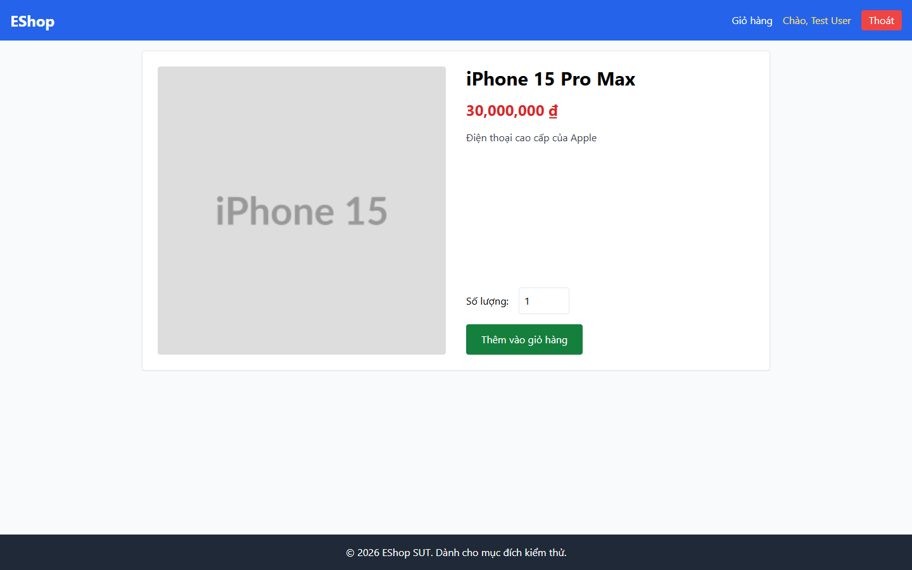

# BUG-PRODDETAIL-009: Phản hồi sau khi thêm vào giỏ quá mờ nhạt, nút không bị vô hiệu khi xử lý và header không có badge đếm

## Found by Test Case

PRODDETAIL-FDB-05, PRODDETAIL-FDB-06, PRODDETAIL-FDB-07 (GUI Checklist — Product Detail)

## Requirement liên quan

FR-06 (Xem chi tiết sản phẩm — "sau khi bấm hiển thị phản hồi trực quan (toast notification hoặc badge cập nhật)")

## Severity / Priority

Minor / P2

## Environment

- Browser: Chromium (Playwright MCP), viewport 1440×900
- OS: Windows 11
- URL: http://localhost:5173/product/1
- Build: nhánh `hw3/23127211`, commit `ff96609`

## Steps to reproduce

**Kịch bản 1 — Độ nổi bật của xác nhận (FDB-05):**

1. Mở `http://localhost:5173/product/1`
2. Bấm "Thêm vào giỏ hàng" hai lần (do `BUG-PRODDETAIL-001`) cho tới khi thêm thành công
3. Quan sát xem hệ thống xác nhận thành công ở những vị trí nào trên màn hình

**Kịch bản 2 — Trạng thái nút khi đang xử lý (FDB-06):**

1. Ngay sau khi bấm, kiểm tra thuộc tính `disabled`, `aria-busy`, `aria-disabled` của nút

**Kịch bản 3 — Badge giỏ hàng (FDB-07):**

1. Sau khi thêm thành công, nhìn lên link "Giỏ hàng" ở header mà không rời trang

## Expected result

- FDB-05: Xác nhận đủ nổi bật để nhận ra ngay cả khi mắt người dùng không đặt trên nút (ví dụ toast hoặc thay đổi ở giỏ hàng)
- FDB-06: Nút chuyển sang trạng thái vô hiệu hoặc đang xử lý, ngăn người dùng bấm chồng lần nữa
- FDB-07: Link "Giỏ hàng" hiển thị số lượng mặt hàng cập nhật ngay, không cần mở trang giỏ để biết

## Actual result

**FDB-05 — Xác nhận chỉ nằm bên trong chính nút vừa bấm.** Toàn bộ phản hồi thành công là việc nhãn nút đổi từ "Thêm vào giỏ hàng" thành "Đã thêm" trong 2003 ms. Không có toast, không có thay đổi nào ở header hay bất kỳ vùng nào khác của trang. Người dùng vừa bấm xong mà đưa mắt sang chỗ khác (ví dụ nhìn lên giỏ hàng) sẽ bỏ lỡ hoàn toàn xác nhận này.

**FDB-06 — Nút không bao giờ bị vô hiệu.** Kiểm tra ngay trong lúc thao tác đang xử lý:

- `disabled` = `false`
- `aria-busy` = `null`
- `aria-disabled` = `null`

Nút luôn ở trạng thái bấm được, bỏ ngỏ khả năng double-submit.

**FDB-07 — Header không có badge đếm.** Sau khi thêm thành công, `textContent` của link header vẫn đúng chuỗi `Giỏ hàng`, không chứa chữ số nào. Người dùng buộc phải mở trang Giỏ hàng mới biết trong giỏ đang có gì.

## Evidence

- Screenshot (sau khi thêm thành công, header vẫn chỉ là "Giỏ hàng" không badge): 

## Notes

FR-06 nêu rõ yêu cầu "toast notification **hoặc** badge cập nhật" — hiện tại SUT không có cả hai. Ba lỗi được gom chung vì cùng thuộc lớp phản hồi của một thao tác và nên sửa trong cùng một lần: thêm badge đếm vào link "Giỏ hàng" ở header (giải quyết FDB-05 và FDB-07), và set `disabled` cho nút trong lúc xử lý (FDB-06).
