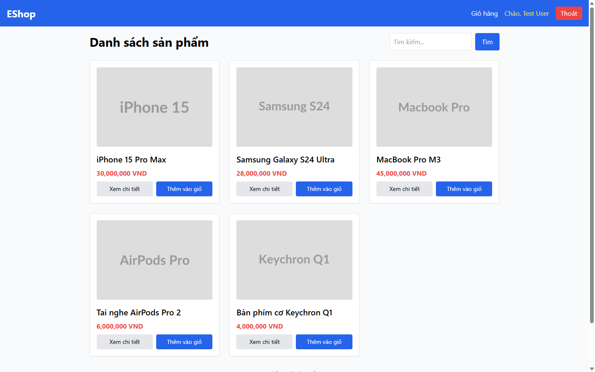

# BUG-PRODDETAIL-012: Mất vị trí cuộn khi bấm Back và mất ngữ cảnh trang sau khi đăng nhập

## Found by Test Case

PRODDETAIL-NAV-03, PRODDETAIL-NAV-10 (GUI Checklist — Product Detail)

## Requirement liên quan

FR-06 (Xem chi tiết sản phẩm), FR-01 (Đăng nhập)

## Severity / Priority

Minor / P3

## Environment

- Browser: Chromium (Playwright MCP), viewport 1440×900
- OS: Windows 11
- URL: http://localhost:5173/ và http://localhost:5173/product/1
- Build: nhánh `hw3/23127211`, commit `ff96609`
- Tài khoản test: `test@eshop.com` / `Test1234!`

## Steps to reproduce

**Kịch bản 1 — Mất vị trí cuộn khi Back (NAV-03):**

1. Mở `http://localhost:5173/` ở viewport 1440×900
2. Cuộn trang xuống (trang Home cao 1018 px, vùng nhìn 900 px → `scrollY` tối đa là 118)
3. Bấm vào một sản phẩm để mở trang chi tiết
4. Bấm nút Back của trình duyệt
5. Quan sát vị trí cuộn của trang Home

**Kịch bản 2 — Mất ngữ cảnh sau đăng nhập (NAV-10):**

1. Mở `http://localhost:5173/product/1`
2. Thêm sản phẩm vào giỏ
3. Bấm "Đăng nhập" trên header
4. Đăng nhập bằng `test@eshop.com` / `Test1234!`
5. Quan sát trang được đưa tới sau khi đăng nhập thành công

## Expected result

- NAV-03: Quay lại đúng trang Home, giữ nguyên vị trí cuộn trước đó
- NAV-10: Sau đăng nhập người dùng được đưa về đúng ngữ cảnh trước đó; header hiển thị tên người dùng và giỏ hàng không bị mất

## Actual result

**NAV-03 — Mất vị trí cuộn.** Cuộn Home tới `scrollY` = 118, mở trang chi tiết rồi bấm Back: URL quay về đúng `http://localhost:5173/` nhưng `scrollY` = **0** — trang nhảy về đầu. Người dùng đang duyệt giữa danh sách phải cuộn lại từ đầu sau mỗi lần xem chi tiết một sản phẩm.

**NAV-10 — Mất ngữ cảnh sau đăng nhập.** Đăng nhập từ trang `/product/1`:

| Vế của ER                       | Kết quả thực tế                       | Đạt? |
| ------------------------------- | ------------------------------------- | ---- |
| Đưa về đúng ngữ cảnh trước đó   | Bị đưa về `/` (trang Home)            | ❌   |
| Header hiển thị tên người dùng  | Header hiện "Chào, Test User"         | ✅   |
| Giỏ hàng không bị mất           | Giỏ hàng còn nguyên sản phẩm đã thêm  | ✅   |

Người dùng đang xem một sản phẩm cụ thể, sau khi đăng nhập bị đẩy về trang chủ và phải tự tìm lại sản phẩm đó.

## Evidence

- Screenshot (trang Home nhảy về đầu sau khi bấm Back): 

## Notes

Hai vấn đề đều thuộc nhóm "giữ ngữ cảnh điều hướng" và làm gián đoạn hành trình duyệt sản phẩm, tuy không chặn chức năng nào nên xếp P3. Hướng sửa: (1) dùng `ScrollRestoration` của React Router hoặc tự lưu `scrollY` theo từng route; (2) truyền URL hiện tại làm tham số `redirect` khi chuyển sang trang đăng nhập và điều hướng trả về sau khi đăng nhập thành công.

**Phát hiện ngoài phạm vi checklist này:** khi chạy NAV-10 nhận thấy cả hai ô của form đăng nhập đều là `type="text"` — ô mật khẩu **không được che dấu**. Vấn đề này thuộc màn hình Login, nên lập bug riêng cho module LOGIN chứ không gộp vào đây.
