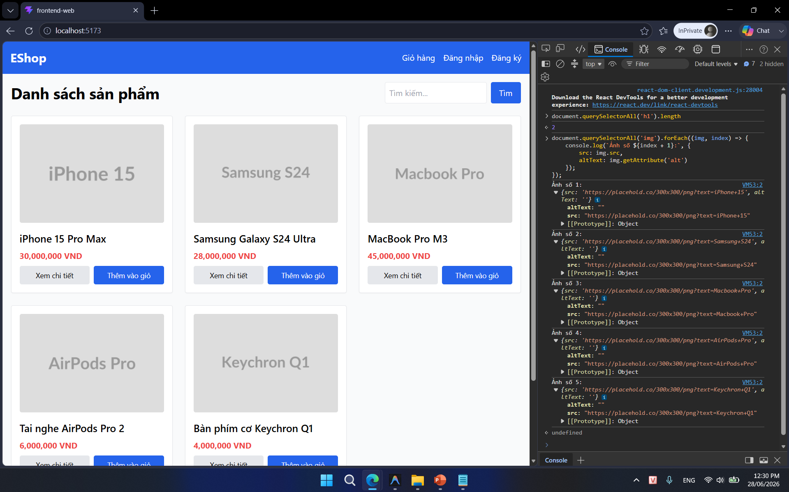
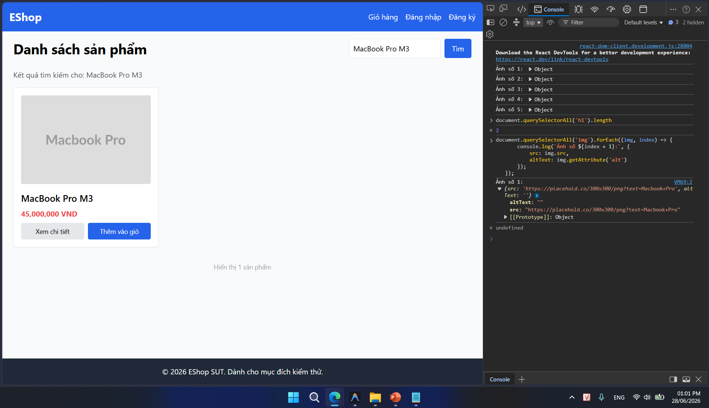
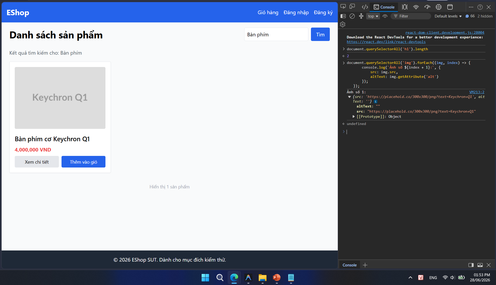
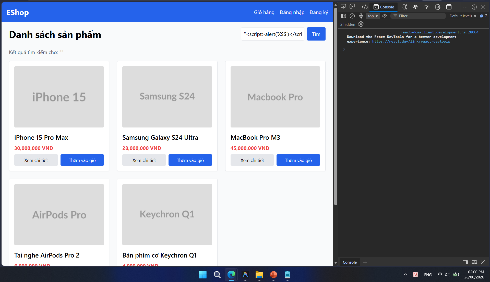
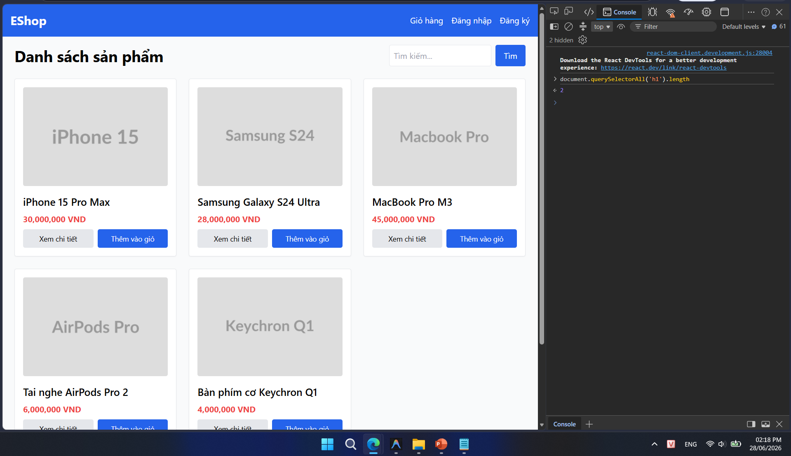
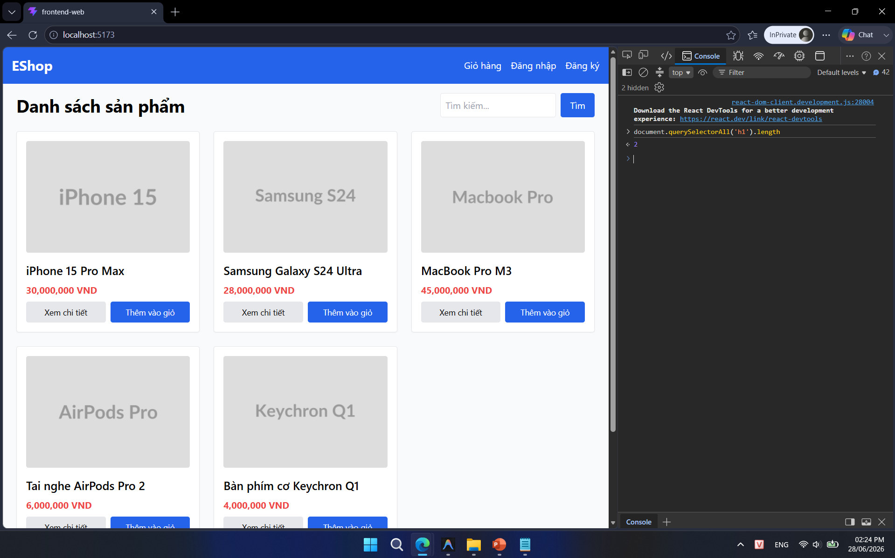
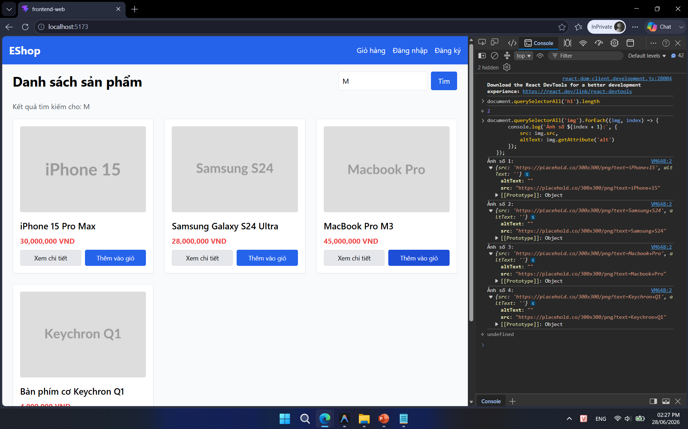
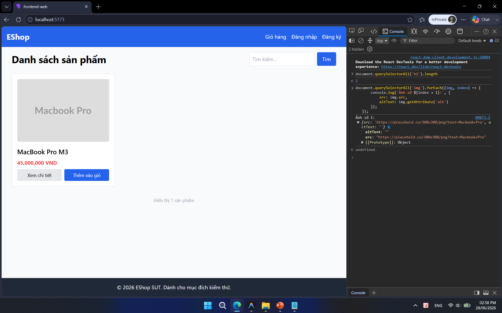

## Found by Test Case

TC-PLAS-001, TC-PLAS-002, TC-PLAS-004, TC-PLAS-005, TC-PLAS-006, TC-PLAS-007, TC-PLAS-BVA-001, TC-PLAS-BVA-005

## Requirement liên quan

FR-05 (Xem danh sách & Tìm kiếm sản phẩm)

## Severity / Priority

Minor / P2

## Environment

Browser: Google Chrome / Microsoft Edge, OS: Windows, URL: http://localhost:5173

## Steps to reproduce

1. Truy cập trang chủ EShop (`http://localhost:5173`).

2. Mở Developer Tools (nhấn F12), chuyển sang tab Console.

3. Chạy lệnh: `document.querySelectorAll('h1').length`.

## Expected result

Chỉ tồn tại đúng 1 thẻ `<h1>` duy nhất trên trang chủ phục vụ chuẩn SEO.

## Actual result

Hệ thống trả về kết quả là 2 hoặc 3 (có nhiều thẻ `<h1>` tồn tại trên trang).

## Evidence

- **TC-PLAS-001 (Xem danh sách):**
  
- **TC-PLAS-002 (Tìm kiếm):**
  
- **TC-PLAS-004 (Tìm kiếm có dấu):**
  
- **TC-PLAS-005 (Tìm kiếm ký tự đặc biệt):**
  
- **TC-PLAS-006 (Trễ tải mạng - 2 thẻ h1):**
  
- **TC-PLAS-007 (Cấu trúc H1 trang chủ):**
  
- **TC-PLAS-BVA-001 (Tìm kiếm 1 ký tự):**
  
- **TC-PLAS-BVA-005 (Database chỉ có 1 sản phẩm):**
  