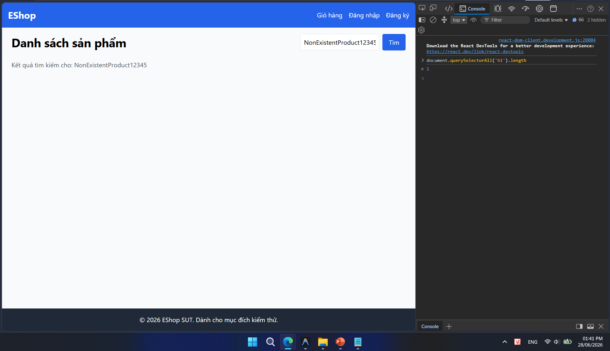

## Found by Test Case

TC-PLAS-003

## Requirement liên quan

FR-05 (Xem danh sách & Tìm kiếm sản phẩm)

## Severity / Priority

Minor / P2

## Environment

Browser: Google Chrome / Microsoft Edge, OS: Windows, URL: http://localhost:5173

## Steps to reproduce

1. Truy cập trang chủ EShop (`http://localhost:5173`).

2. Nhập từ khóa không tồn tại vào thanh tìm kiếm (Ví dụ: `"NonExistentProduct12345"`).

3. Bấm nút Tìm kiếm (hoặc nhấn Enter).

4. Quan sát giao diện khu vực hiển thị sản phẩm.

## Expected result

Lưới sản phẩm trống và phải hiển thị một thông báo phản hồi (empty state) phù hợp (ví dụ: "Không tìm thấy sản phẩm nào" hoặc "No products found").

## Actual result

Lưới sản phẩm trống nhưng không có bất kỳ thông báo hay thông tin phản hồi empty state nào xuất hiện trên màn hình.

## Evidence

- **TC-PLAS-003 (Tìm kiếm không kết quả):**
  
