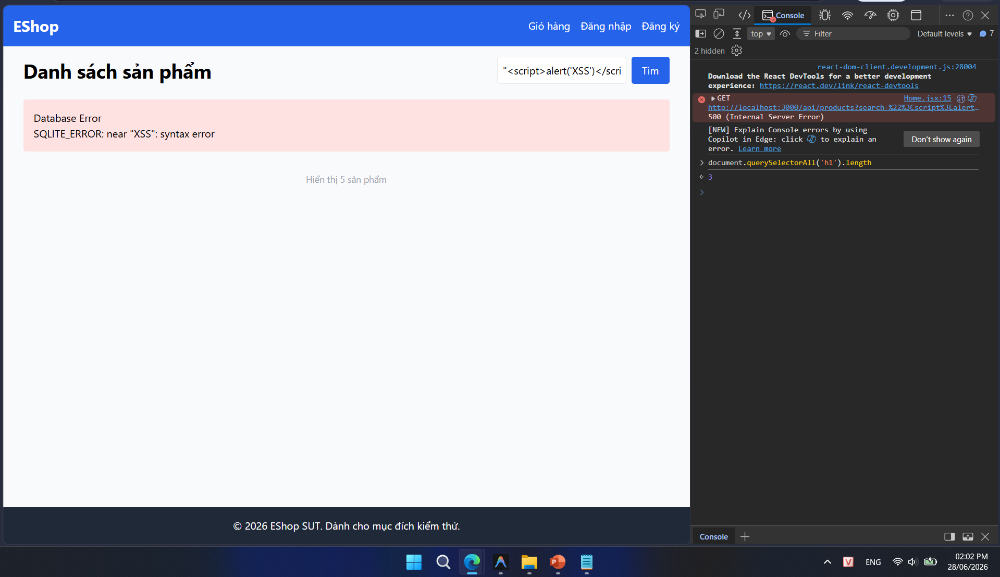

## Found by Test Case

TC-PLAS-005

## Requirement liên quan

FR-05 (Xem danh sách & Tìm kiếm sản phẩm)

## Severity / Priority

Major / P1

## Environment

Browser: Google Chrome / Microsoft Edge, OS: Windows, URL: http://localhost:5173

## Steps to reproduce

1. Truy cập trang chủ EShop (`http://localhost:5173`).

2. Nhập từ khóa `"<script>alert('XSS')</script>"` vào thanh tìm kiếm.

3. Bấm nút Tìm kiếm (hoặc nhấn Enter).

4. Quan sát nội dung thông báo lỗi hiển thị trên màn hình.

## Expected result

Lưới sản phẩm trống và phải hiển thị một thông báo phản hồi (empty state) phù hợp, lịch sự và thân thiện với người dùng (ví dụ: "Không tìm thấy sản phẩm nào" hoặc "No products found").

## Actual result

Hệ thống phản hồi lỗi SQLite trực tiếp lên màn hình dưới dạng HTML:
```html
<h1>Database Error</h1>
<p>SQLITE_ERROR: near "XSS": syntax error</p>
```
Lỗi này cho thấy câu lệnh SQL được nối chuỗi trực tiếp (SQL Injection vulnerability) và exception của database không được catch/xử lý để hiển thị giao diện thân thiện cho người dùng.

## Evidence

- **TC-PLAS-005 (Tìm kiếm ký tự đặc biệt):**
  
- **TC-PLAS-005 (Tìm kiếm ký tự đặc biệt - Lỗi hệ thống thô):**
  
