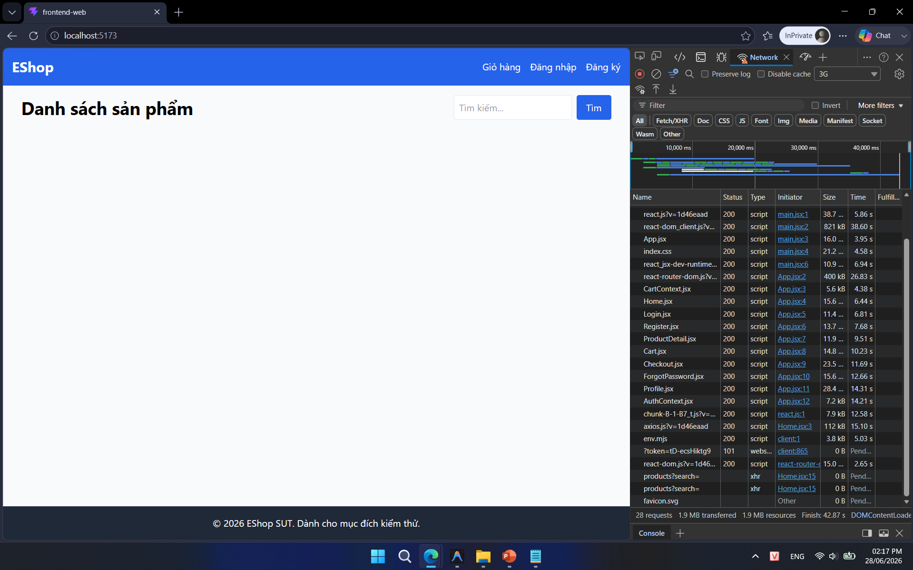

## Found by Test Case

TC-PLAS-006

## Requirement liên quan

FR-05 (Xem danh sách & Tìm kiếm sản phẩm)

## Severity / Priority

Minor / P2

## Environment

Browser: Google Chrome / Microsoft Edge, OS: Windows, URL: http://localhost:5173

## Steps to reproduce

1. Mở Chrome Developer Tools, chuyển sang tab Network và cấu hình throttling là `Slow 3G`.

2. Truy cập trang chủ EShop (`http://localhost:5173`).

3. Quan sát giao diện ngay khi trang bắt đầu tải dữ liệu.

## Expected result

Trong lúc dữ liệu đang được tải từ backend, giao diện phải hiển thị rõ ràng một chỉ báo đang tải (ví dụ: loading spinner, progress bar, hoặc dòng chữ "Đang tải...").

## Actual result

Hệ thống chỉ hiển thị một màn hình trắng tinh (blank screen) không có bất kỳ phản hồi hay thành phần chỉ báo loading nào trong suốt thời gian tải dữ liệu.

## Evidence

- **TC-PLAS-006 (Không có loading indicator - Màn hình trắng):**
  
