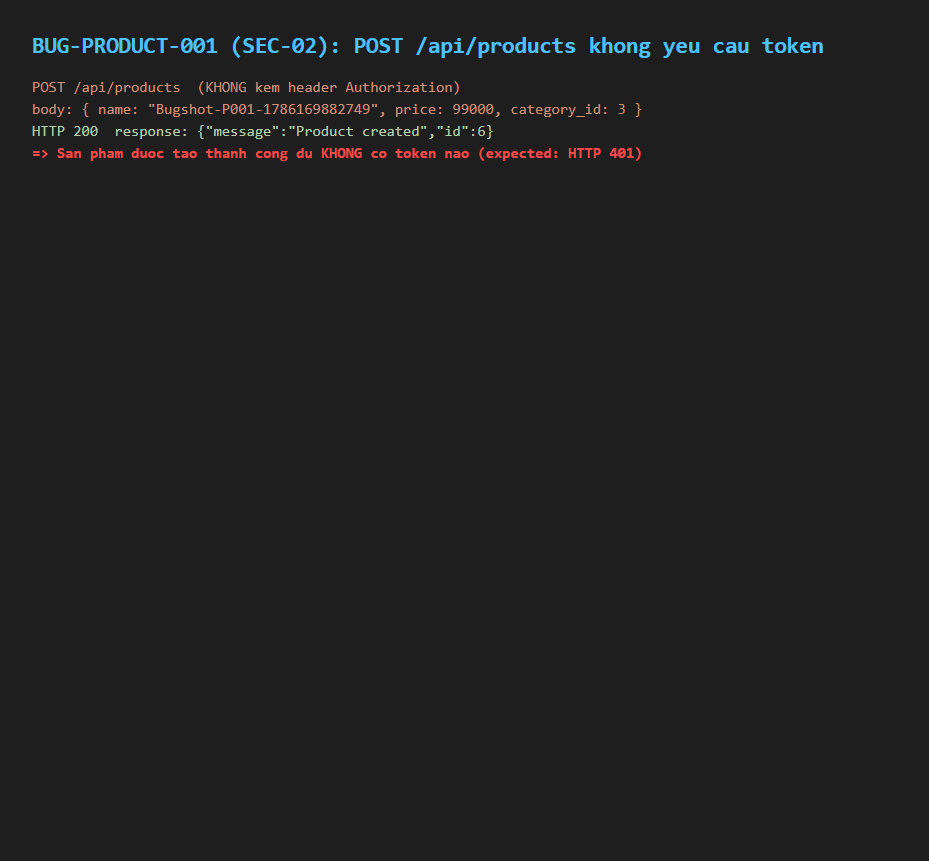

# BUG-PRODUCT-001: API tạo/sửa/xoá sản phẩm không yêu cầu xác thực (JWT)

## Found by Test Case

TC-PRODUCT-013

## Requirement liên quan

FR-12 / SEC-02 (Access control — API có tính ảnh hưởng dữ liệu phải yêu cầu JWT hợp lệ)

## Severity / Priority

Blocker / P0

## Environment

- Browser: Chromium, Firefox, WebKit — tái hiện trên cả 3
- OS: Windows 11
- URL: API: POST http://localhost:3000/api/products (không kèm header Authorization)
- Build: nhánh `hw04/23127211`, commit `3d2a86d`

## Steps to reproduce

1. Gọi `POST /api/products` **không kèm** header `Authorization`, body gồm `name`, `price`, `category_id` hợp lệ.
2. Quan sát status code trả về và danh sách sản phẩm sau đó.

## Expected result

Request bị từ chối với status `401 Unauthorized`; không có sản phẩm nào được tạo.

## Actual result

Request trả về **status 200**, sản phẩm được tạo thành công dù không có bất kỳ token nào. Xác nhận qua `backend/server.js`: các route `POST /api/products` (dòng 167), `PUT /api/products/:id` (dòng 179), `DELETE /api/products/:id` (dòng 191) đều **không gắn middleware `authenticateToken`**, trong khi 3 route tương ứng của category ngay bên dưới (`POST/PUT/DELETE /api/categories`, dòng 249/257/269) đều có gắn middleware này. Bất kỳ ai — kể cả không đăng nhập — đều có thể tạo/sửa/xoá sản phẩm.

## Evidence



- HTML report: `tests/e2e/reports/html/product-chromium/index.html` (và firefox/webkit) — test `TC-PRODUCT-013` (Failed): `expect([401]).toContain(res.status())` nhận `200`.
- Bằng chứng đối chiếu route (grep `backend/server.js`):
  ```
  167:app.post("/api/products", (req, res) => {          <- KHONG co authenticateToken
  179:app.put("/api/products/:id", (req, res) => {        <- KHONG co authenticateToken
  191:app.delete("/api/products/:id", (req, res) => {     <- KHONG co authenticateToken
  249:app.post("/api/categories", authenticateToken, ...  <- CO
  ```

## Notes

Lỗ hổng nghiêm trọng nhất trong feature Quản lý Sản phẩm — nên vá ưu tiên cao nhất cùng BUG-PRODUCT-002.
