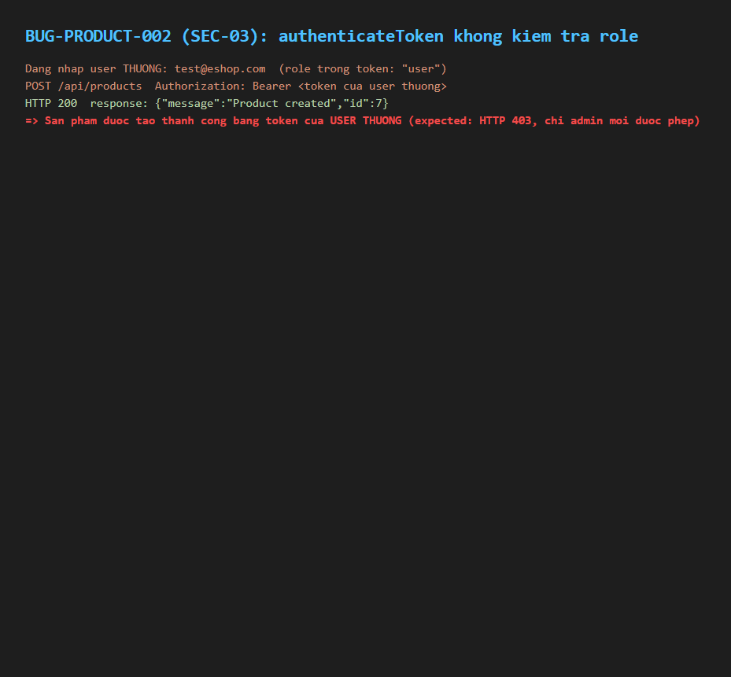

# BUG-PRODUCT-002 (SEC-03): authenticateToken không kiểm tra role — user thường vẫn thực hiện được thao tác admin

## Found by Test Case

TC-PRODUCT-014

## Requirement liên quan

FR-12 / SEC-03 (Access control — token hợp lệ nhưng role khác admin phải bị từ chối với các thao tác admin)

## Severity / Priority

Blocker / P0

## Environment

- Browser: Chromium, Firefox, WebKit — tái hiện trên cả 3
- OS: Windows 11
- URL: API: POST http://localhost:3000/api/products (kèm token của user thường)
- Build: nhánh `hw04/23127211`, commit `3d2a86d`

## Steps to reproduce

1. Đăng nhập bằng tài khoản **user thường** (`test@eshop.com`, không phải admin), lấy JWT token.
2. Gọi `POST /api/products` kèm `Authorization: Bearer <token của user thường>`, body sản phẩm hợp lệ.
3. Quan sát status code trả về.

## Expected result

Request bị từ chối với status `403 Forbidden` (token hợp lệ nhưng role không đủ quyền).

## Actual result

Request trả về **status 200**, sản phẩm được tạo thành công bằng token của user thường. Xác nhận qua `backend/server.js:100-110`: middleware `authenticateToken` chỉ gọi `jwt.verify()` để kiểm tra **chữ ký** token hợp lệ rồi gán `req.user`, **không hề kiểm tra `req.user.role === 'admin'`** ở bất kỳ đâu trong middleware hay trong handler của route `/api/products`. Toàn bộ nhóm route `/api/admin/*` cũng chung lỗi này.

## Evidence

- HTML report: `tests/e2e/reports/html/product-chromium/index.html` — test `TC-PRODUCT-014` (Failed): `expect([403]).toContain(res.status())` nhận `200`.

## Notes

Lỗi này tồn tại **độc lập** với BUG-PRODUCT-001 — kể cả khi vá xong BUG-PRODUCT-001 (thêm `authenticateToken` vào 3 route sản phẩm), lỗ hổng leo thang đặc quyền (privilege escalation) này vẫn còn nguyên vì middleware chỉ verify chữ ký, không verify role. Cần vá cả 2 lớp: (1) gắn `authenticateToken`, và (2) thêm kiểm tra `role === 'admin'` (ví dụ middleware `requireAdmin` riêng) cho mọi route quản trị.
