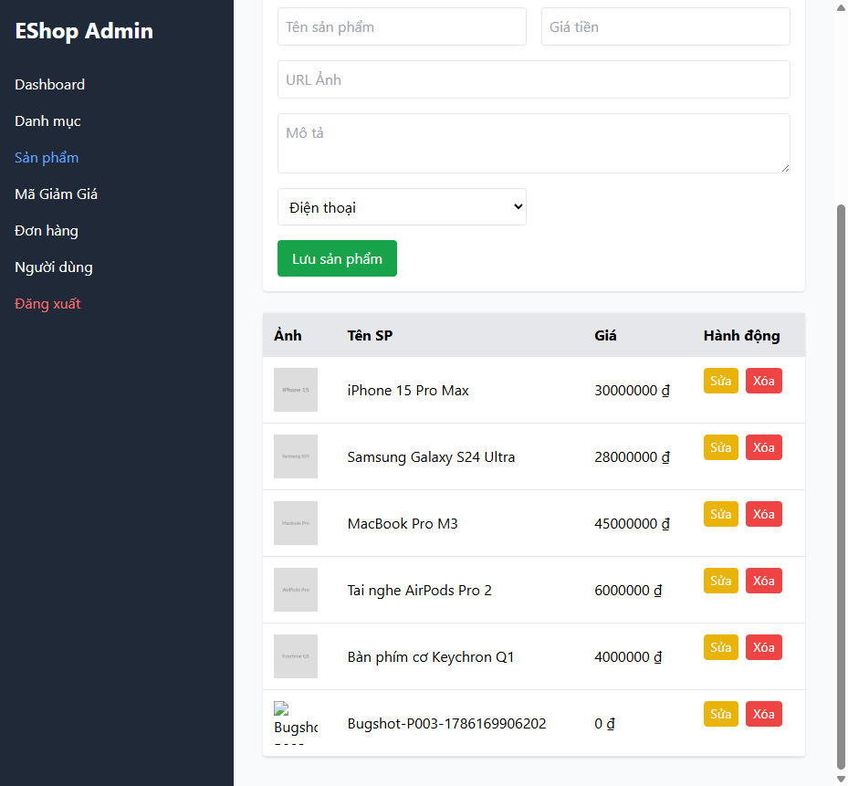

# BUG-PRODUCT-003: Không validate Giá sản phẩm (chấp nhận 0, âm, trống, không phải số)

## Found by Test Case

TC-PRODUCT-007, TC-PRODUCT-008, TC-PRODUCT-009, TC-PRODUCT-010

## Requirement liên quan

FR-15 (Quản lý Sản phẩm — Giá phải là số dương hợp lệ)

## Severity / Priority

Critical / P1

## Environment

- Browser: Chromium, Firefox, WebKit — tái hiện trên cả 3
- OS: Windows 11
- URL: http://localhost:5174 (frontend-admin), API: http://localhost:3000/api/products
- Build: nhánh `hw04/23127211`, commit `3d2a86d`

## Steps to reproduce

**Kịch bản 1 — Giá = 0 (TC-PRODUCT-007):** Đăng nhập Admin → tab Sản phẩm → nhập Tên hợp lệ, Giá = `0` → "Lưu sản phẩm".

**Kịch bản 2 — Giá âm (TC-PRODUCT-008):** Tương tự, Giá = `-1000`.

**Kịch bản 3 — Giá trống (TC-PRODUCT-009):** Tương tự, để trống trường Giá.

**Kịch bản 4 — Giá không phải số (TC-PRODUCT-010, qua API vì UI chặn nhập ký tự):** `POST /api/products` với `price: "abc"`.

## Expected result

Cả 4 kịch bản: hệ thống từ chối, không tạo sản phẩm.

## Actual result

Cả 4 kịch bản đều được **chấp nhận**, sản phẩm được lưu mà không có bất kỳ validate nào cho trường giá. Xác nhận qua `frontend-admin/src/App.jsx:500-508`: input Giá tiền chỉ có `type="number"`, không có `required`, `min`, hay `step`. `backend/server.js:167-177` (`POST /api/products`) cũng không kiểm tra giá trị `price` trước khi `INSERT` — chấp nhận cả chuỗi không phải số.

## Evidence

- HTML report: `tests/e2e/reports/html/product-chromium/index.html` (và firefox/webkit) — test `TC-PRODUCT-007`, `TC-PRODUCT-008`, `TC-PRODUCT-009`, `TC-PRODUCT-010` (Failed): `expect(wasCreated).toBe(false)` / `expect(res.ok()).toBe(false)` đều nhận `true`.

## Notes

TC-PRODUCT-004 (giá = 1, biên dưới hợp lệ) và TC-PRODUCT-016 (giá = 0.01) đều PASS đúng như kỳ vọng — lỗi chỉ xảy ra ở các giá trị biên KHÔNG hợp lệ (0, âm, trống, không phải số), xác nhận đây là thiếu validate hoàn toàn chứ không phải lỗi ngẫu nhiên.
