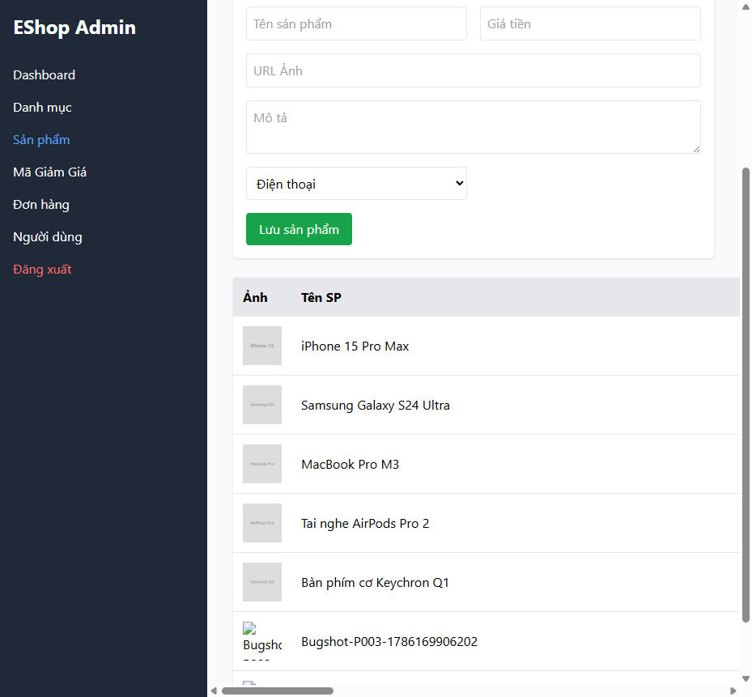

# BUG-PRODUCT-004: Tên sản phẩm không giới hạn độ dài tối đa 255 ký tự

## Found by Test Case

TC-PRODUCT-006

## Requirement liên quan

FR-15 (Quản lý Sản phẩm — Tên sản phẩm tối đa 255 ký tự)

## Severity / Priority

Minor / P3

## Environment

- Browser: Chromium, Firefox, WebKit — tái hiện trên cả 3
- OS: Windows 11
- URL: http://localhost:5174 (frontend-admin)
- Build: nhánh `hw04/23127211`, commit `3d2a86d`

## Steps to reproduce

1. Đăng nhập Admin → tab Sản phẩm.
2. Nhập Tên sản phẩm gồm **256 ký tự** (vượt quá giới hạn 255), Giá hợp lệ.
3. Bấm "Lưu sản phẩm".

## Expected result

Hệ thống từ chối, không tạo sản phẩm (hoặc cắt bớt về đúng 255 ký tự).

## Actual result

Sản phẩm được tạo thành công với tên đầy đủ 256 ký tự. Xác nhận qua `frontend-admin/src/App.jsx:491-499`: input Tên sản phẩm có `required` (nên trường hợp để trống — TC-PRODUCT-005 — đã bị chặn đúng) nhưng **không có `maxLength`**; `backend/server.js` cũng không giới hạn độ dài chuỗi trước khi `INSERT`.

## Evidence

- HTML report: `tests/e2e/reports/html/product-chromium/index.html` — test `TC-PRODUCT-006` (Failed): `expect(wasCreated).toBe(false)` nhận `true` (request gửi đi: có).

## Notes

TC-PRODUCT-002 (255 ký tự, đúng biên trên hợp lệ) PASS bình thường — lỗi chỉ xảy ra khi vượt biên (256 ký tự), xác nhận đây thực sự là thiếu giới hạn trên, không phải lỗi biên dưới/logic khác.
