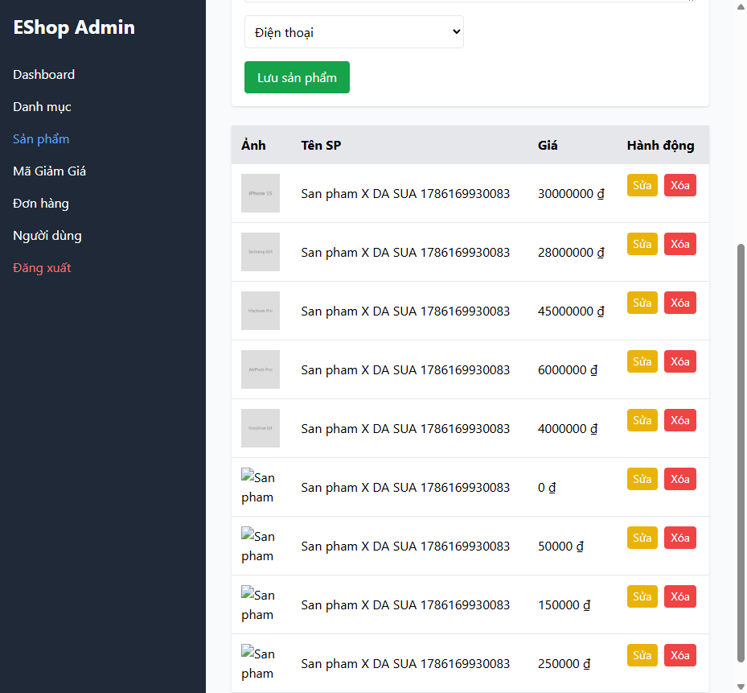

# BUG-PRODUCT-006: Sửa 1 sản phẩm làm đổi TÊN hiển thị của TẤT CẢ sản phẩm khác trên danh sách

## Found by Test Case

TC-PRODUCT-015

## Requirement liên quan

FR-15 (Quản lý Sản phẩm — sửa 1 sản phẩm chỉ được ảnh hưởng đúng sản phẩm đó)

## Severity / Priority

Critical / P1

## Environment

- Browser: Chromium, Firefox, WebKit — quan sát được ở cả 3, nhưng **flaky theo thời gian thực thi** (không ổn định tuyệt đối theo browser cụ thể — có lần chạy pass ở một browser, lần khác lại fail ở cùng browser đó, do phụ thuộc thời điểm `alert()` chặn luồng JS so với lúc assertion kiểm tra DOM)
- OS: Windows 11
- URL: http://localhost:5174 (frontend-admin)
- Build: nhánh `hw04/23127211`, commit `3d2a86d`

## Steps to reproduce

1. Đăng nhập Admin → tab Sản phẩm, tạo sẵn 2 sản phẩm X và Y qua API (dữ liệu riêng, không đụng 5 sản phẩm seed gốc).
2. Bấm "Sửa" trên sản phẩm X, đổi Tên và Giá, bấm "Lưu sản phẩm".
3. Ngay sau khi lưu (chưa reload trang), quan sát dòng của sản phẩm Y trong bảng danh sách.

## Expected result

Chỉ dòng của sản phẩm X đổi tên/giá; dòng của sản phẩm Y (và mọi sản phẩm khác) giữ nguyên tên cũ.

## Actual result

Dòng của sản phẩm Y **cũng bị đổi tên** thành tên mới của X ngay trên giao diện. Xác nhận qua `frontend-admin/src/App.jsx:110-114`:

```js
const fakeMassUpdatedProducts = products.map((p) => ({
  ...p,
  name: productForm.name,
}));
setProducts(fakeMassUpdatedProducts);
```

Sau khi `PUT` thành công, code gán **tên của sản phẩm vừa sửa cho TẤT CẢ sản phẩm** trong state cục bộ, thay vì chỉ cập nhật đúng 1 phần tử. Đây là bug chỉ tồn tại ở **hiển thị phía client** — dữ liệu trong CSDL vẫn đúng (chỉ sản phẩm X bị đổi), và bug biến mất nếu người dùng tải lại trang / gọi lại `fetchData()`. Nếu chỉ kiểm qua API (`GET /api/products`) sẽ **bỏ sót hoàn toàn** bug này vì tầng dữ liệu vẫn đúng — phải kiểm cả 2 tầng: UI ngay sau khi lưu, và API sau đó.

## Evidence



- HTML report: `tests/e2e/reports/html/product-chromium/index.html` — test `TC-PRODUCT-015` (Failed ở assertion soft trên UI): `expect.soft(productRow(page, 'San pham Y ...')).toHaveCount(1)` nhận count = 0 ngay sau khi lưu; assertion cứng qua API (`GET /api/products`) sau đó vẫn PASS, xác nhận CSDL không bị ảnh hưởng.

## Notes

Test case này flaky theo lần chạy (không phải theo browser) — trong 2 lần chạy full suite liên tiếp, số lần fail dao động (đôi khi PASS ở webkit/firefox, đôi khi FAIL ở cả 3), khả năng cao do timing giữa `alert("Cập nhật thành công!")` chặn luồng JS đồng bộ và thời điểm Playwright đọc DOM để assert. Cần điều tra thêm nếu muốn ổn định hoá; tuy nhiên bug chức năng (mass-rename) là có thật và đã xác nhận qua source, không phụ thuộc vào tính flaky của assertion.
