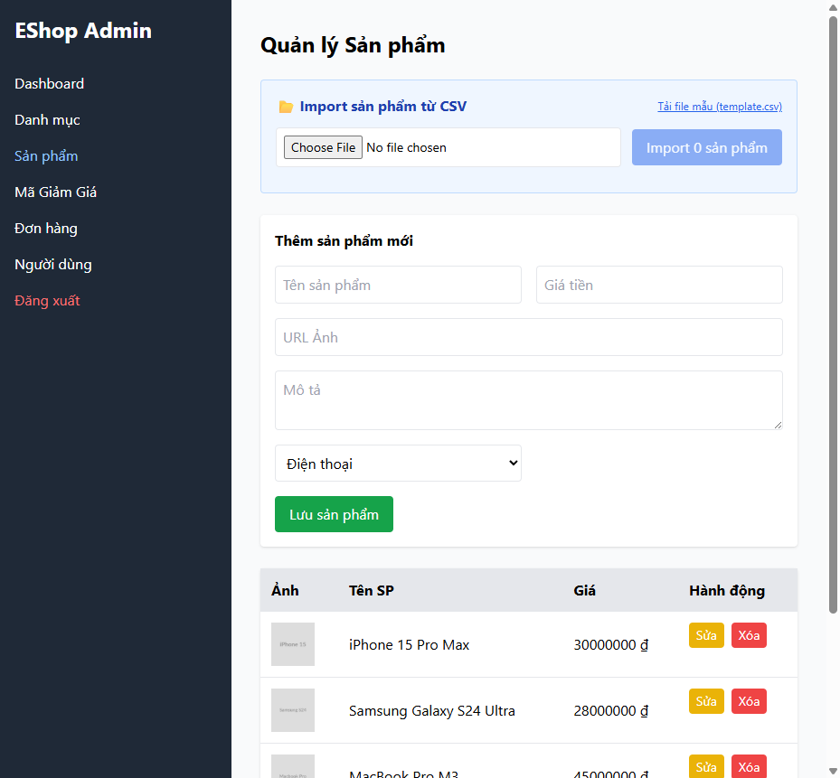

# BUG-PRODUCT-007: Giá sản phẩm trong danh sách Admin hiển thị không có dấu phân cách hàng nghìn

## Found by Test Case

TC-PRODUCT-017

## Requirement liên quan

FR-21 (Giá tiền phải luôn dùng ký hiệu ₫ với định dạng phân cách hàng nghìn)

## Severity / Priority

Minor / P3

## Environment

- Browser: Chromium, Firefox, WebKit — tái hiện trên cả 3
- OS: Windows 11
- URL: http://localhost:5174 (frontend-admin)
- Build: nhánh `hw04/23127211`, commit `3d2a86d`

## Steps to reproduce

1. Đăng nhập Admin → tab Sản phẩm, đảm bảo có sản phẩm với giá ≥ 1000 (ví dụ 150.000).
2. Quan sát cột "Giá" trong bảng danh sách sản phẩm.

## Expected result

Giá hiển thị có dấu phân cách hàng nghìn, ví dụ `150,000 ₫`.

## Actual result

Giá hiển thị dạng số thô, không phân cách: `150000 ₫`. Xác nhận qua `frontend-admin/src/App.jsx:590`: `<td className="p-3">{p.price} ₫</td>` — render trực tiếp giá trị số, không qua `Number(...).toLocaleString()` như các nơi khác trong ứng dụng (ví dụ Dashboard tổng doanh thu đã dùng `toLocaleString()`).

## Evidence

- HTML report: `tests/e2e/reports/html/product-chromium/index.html` — test `TC-PRODUCT-017` (soft-fail): `expect.soft(row).toContainText('150,000')` nhận text thực tế `"San pham X ...150000 ₫SửaXóa"`.

## Notes

Lỗi cosmetic, độ ưu tiên thấp; cùng loại lỗi định dạng tiền tệ với BUG-CART-005 (nên rà soát toàn bộ codebase để tìm các chỗ khác quên `toLocaleString()`).
