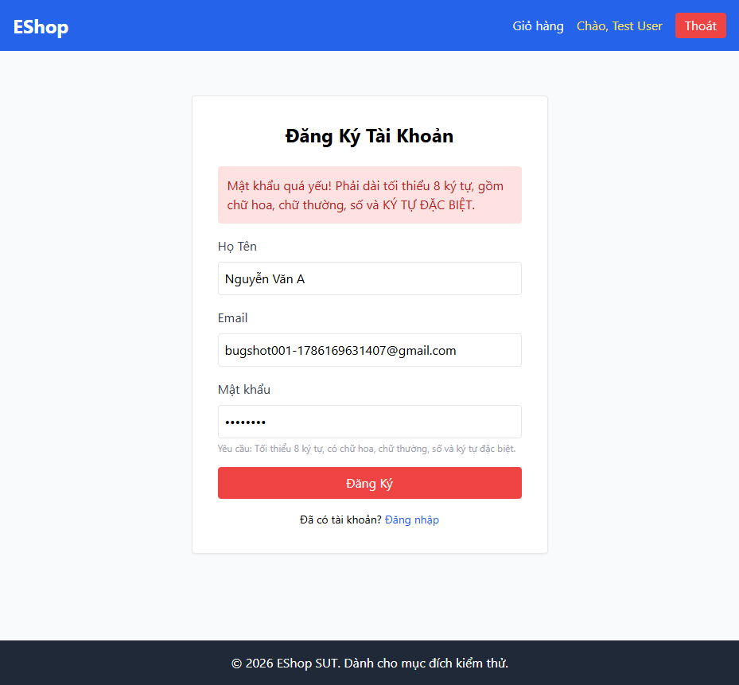

# BUG-REGISTER-001: Regex mật khẩu phía frontend chặn TẤT CẢ mật khẩu hợp lệ theo FR-01

## Found by Test Case

TC-REGISTER-001, TC-REGISTER-015, TC-REGISTER-016

## Requirement liên quan

FR-01 (Đăng ký tài khoản — mật khẩu mạnh: tối thiểu 8 ký tự, có chữ hoa, chữ thường, số và ký tự đặc biệt trong tập `@$!%*?&`)

## Severity / Priority

Critical / P1

## Environment

- Browser: Chromium, Firefox, WebKit (Playwright Desktop Chrome/Firefox/Safari) — tái hiện trên cả 3
- OS: Windows 11
- URL: http://localhost:5173/register (frontend-web), API: http://localhost:3000
- Build: nhánh `hw04/23127211`, commit `3d2a86d`

## Steps to reproduce

1. Mở trang Đăng ký (`/register`).
2. Nhập Họ Tên và Email hợp lệ.
3. Nhập Mật khẩu `Abcd123!` (đúng yêu cầu FR-01: ≥8 ký tự, có hoa/thường/số/ký tự đặc biệt thuộc tập cho phép).
4. Bấm "Đăng Ký".

## Expected result

Tài khoản được tạo thành công, chuyển hướng sang trang Đăng nhập.

## Actual result

Hệ thống từ chối với thông báo "Mật khẩu quá yếu! Phải dài tối thiểu 8 ký tự, gồm chữ hoa, chữ thường, số và KÝ TỰ ĐẶC BIỆT." Không có tài khoản nào được tạo.

Nguyên nhân gốc (đã xác minh qua source): `frontend-web/src/pages/Register.jsx:15` dùng regex

```js
const flawedStrongPasswordRegex = /^(?=.*[a-z])(?=.*[A-Z])(?=.*\d)(?=.*\s)[A-Za-z\d\s]{8,}$/;
```

Regex này **bắt buộc phải có khoảng trắng** (`(?=.*\s)`) và tập ký tự cho phép chỉ gồm `[A-Za-z\d\s]` — **không chứa bất kỳ ký tự nào** trong tập `@$!%*?&` mà FR-01 yêu cầu. Về mặt toán học, không tồn tại mật khẩu nào vừa thoả FR-01 (phải có 1 ký tự thuộc `@$!%*?&`) vừa lọt qua được regex này (cấm toàn bộ các ký tự đó). Do đó **100% người dùng nhập đúng theo hướng dẫn hiển thị ngay trên form đều bị chặn đăng ký**, kể cả các trường hợp biên hợp lệ (TC-REGISTER-015, 016).

## Evidence



- HTML report: `tests/e2e/reports/html/register-chromium/index.html` (và `register-firefox`, `register-webkit`) — xem test `TC-REGISTER-001`, `TC-REGISTER-015`, `TC-REGISTER-016` (trạng thái Failed), có kèm trace/video/screenshot khi fail (`screenshot: 'only-on-failure'`, `trace: 'retain-on-failure'` theo `playwright.config.ts`).
- Console log tại thời điểm fail: `expect(page).toHaveURL(/\/login$/)` — nhận được URL vẫn là `/register`.

## Notes

Bug này còn khiến TC-REGISTER-003 và TC-REGISTER-004 (vốn dùng cùng mật khẩu `Abcd123!` để kiểm tra riêng lỗi định dạng email / email trùng) bị chặn nhầm lý do ngay tại bước mật khẩu — team automation đã phải tách 2 case đó ra gọi thẳng API để cách ly đúng bug cần kiểm (xem BUG-REGISTER-003, BUG-REGISTER-004).
