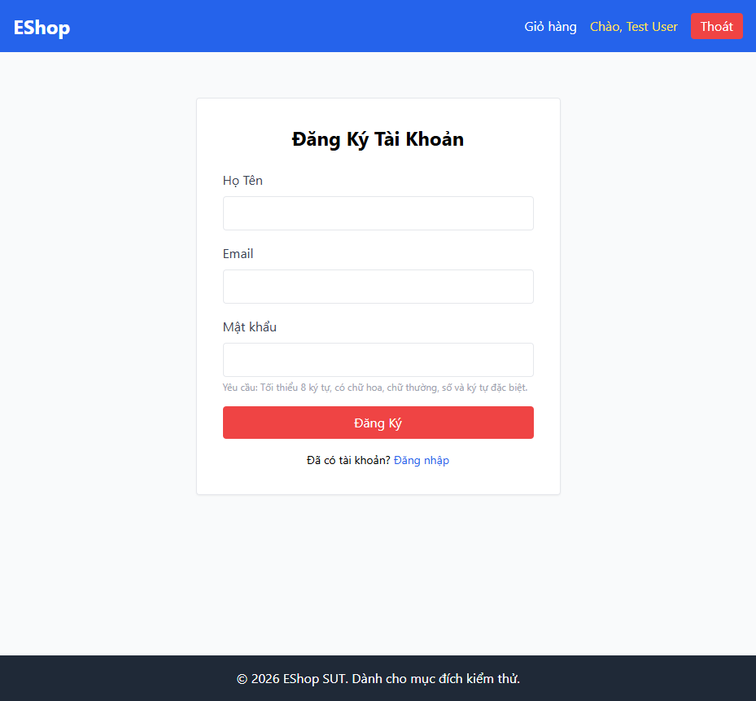

# BUG-REGISTER-002: Form đăng ký thiếu trường "Xác nhận mật khẩu"

## Found by Test Case

TC-REGISTER-013, TC-REGISTER-014

## Requirement liên quan

FR-01 (Đăng ký tài khoản — phải có trường Xác nhận mật khẩu, hệ thống từ chối nếu hai trường không khớp)

## Severity / Priority

Major / P2

## Environment

- Browser: Chromium, Firefox, WebKit — tái hiện trên cả 3
- OS: Windows 11
- URL: http://localhost:5173/register
- Build: nhánh `hw04/23127211`, commit `3d2a86d`

## Steps to reproduce

1. Mở trang Đăng ký (`/register`).
2. Quan sát toàn bộ các trường trên form.

## Expected result

Form có 4 trường: Họ Tên, Email, Mật khẩu, **Xác nhận mật khẩu**. Nếu Mật khẩu và Xác nhận mật khẩu không khớp (hoặc Xác nhận mật khẩu để trống), hệ thống hiển thị lỗi tương ứng và không tạo tài khoản.

## Actual result

Form (`frontend-web/src/pages/Register.jsx:34-68`) chỉ có 3 trường: Họ Tên, Email, Mật khẩu. Không có trường "Xác nhận mật khẩu" nào trong DOM — không thể kiểm tra hành vi khớp/không khớp vì trường này không tồn tại.

## Evidence

- HTML report: `tests/e2e/reports/html/register-chromium/index.html` — test `TC-REGISTER-013`, `TC-REGISTER-014` (Failed): `expect(field(page, 'Xác nhận mật khẩu')).toHaveCount(1)` nhận count = 0.
- Có thể xác minh trực tiếp bằng DevTools trên `http://localhost:5173/register`.

## Notes

Do trường không tồn tại, test được thiết kế lại để assert sự TỒN TẠI của trường thay vì thao tác điền/so khớp (vốn không thể thực hiện được qua UI hiện tại).
