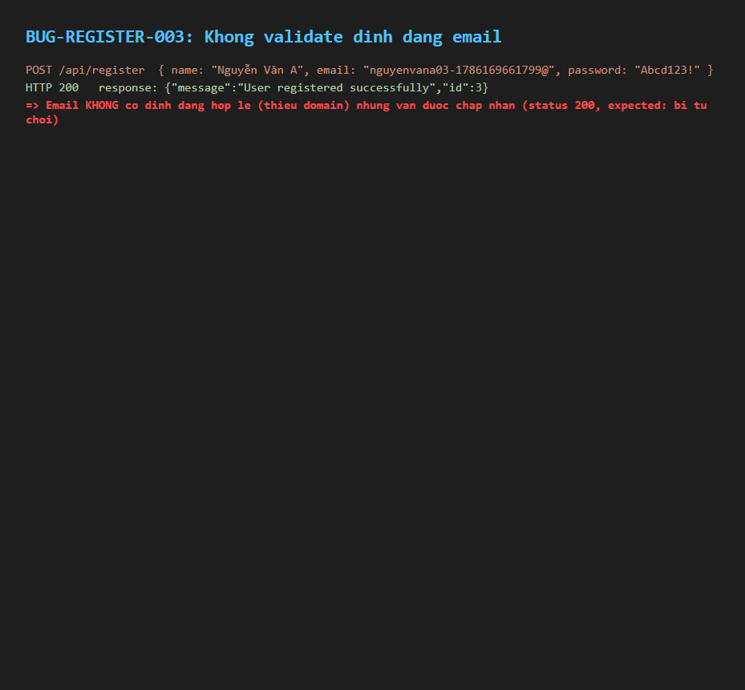

# BUG-REGISTER-003: Không validate định dạng email khi đăng ký (chấp nhận email thiếu domain)

## Found by Test Case

TC-REGISTER-003

## Requirement liên quan

FR-01 (Đăng ký tài khoản — Email phải có định dạng hợp lệ `user@domain.com`)

## Severity / Priority

Major / P2

## Environment

- Browser: Chromium, Firefox, WebKit — tái hiện trên cả 3
- OS: Windows 11
- URL: http://localhost:5173/register, API: POST http://localhost:3000/api/register
- Build: nhánh `hw04/23127211`, commit `3d2a86d`

## Steps to reproduce

1. Gọi trực tiếp `POST /api/register` với `email: "nguyenvana03@"` (thiếu phần domain), `password` hợp lệ theo FR-01, `name` hợp lệ.
   - (Không thể tái hiện qua UI bằng mật khẩu hợp lệ theo FR-01 vì bị BUG-REGISTER-001 chặn trước; script automation vì vậy gọi thẳng API để cách ly đúng lỗi cần kiểm — xem Notes.)
2. Quan sát status code và dữ liệu trong bảng `users`.

## Expected result

Request bị từ chối (400/422 hoặc tương đương), không có tài khoản nào được tạo với email sai định dạng.

## Actual result

Request thành công (`res.ok() === true`), tài khoản được tạo với email `"nguyenvana03@"`. Xác minh: input Email trong `Register.jsx:46-53` dùng `type="text"` (không phải `type="email"`, nên trình duyệt không tự validate định dạng), và `backend/server.js:20-30` (`POST /api/register`) thực hiện `INSERT` thẳng vào bảng `users` mà không có bất kỳ bước validate định dạng email nào ở cả hai tầng client và server.

## Evidence

- HTML report: `tests/e2e/reports/html/register-chromium/index.html` — test `TC-REGISTER-003: Email sai dinh dang (kiem qua API - xem knownIssues)` (Failed): `expect(res.ok()).toBe(false)` nhận `true`.

## Notes

Ban đầu test case này được thiết kế thao tác qua UI, nhưng vì mật khẩu hợp lệ theo FR-01 luôn bị BUG-REGISTER-001 chặn trước, test đã được đổi sang gọi thẳng API để cô lập đúng lỗi validate email (không bị lỗi mật khẩu che khuất).
